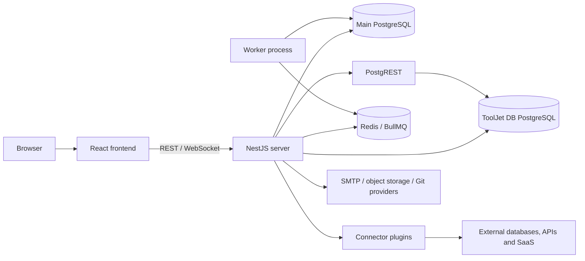
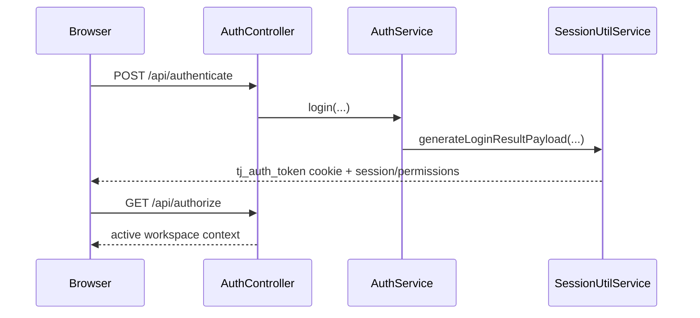

# ToolJet public architecture map

## Scope

This map covers the public repository and Community Edition paths. It does not inspect private code in `frontend/ee` or `server/ee`. Where public base classes are extended by other editions, the boundary is stated rather than inferred.

## System summary

ToolJet is a JavaScript/TypeScript monorepo. A React/Webpack frontend provides the administrative dashboard, App-Builder, ToolJet Database UI, and an isolated released-app viewer bundle. A NestJS server exposes REST and WebSocket endpoints, enforces authentication and CASL permissions, persists platform metadata with TypeORM/PostgreSQL, executes connector queries, and coordinates scheduled/background work through Redis and BullMQ. ToolJet Database uses a second PostgreSQL connection and PostgREST for workspace-scoped row operations.

## Repository and runtime components

| Path/component | Responsibility and entry point |
|---|---|
| `frontend/src/index.jsx` | Browser bootstrap and Sentry-wrapped React root. |
| `frontend/src/RootRouter.jsx::RootRouter` | Root bundle split: `/applications/*` and `/embed-apps/*` load `ViewerApp`; other routes load the main app. |
| `frontend/src/App/App.jsx::AppComponent` | Dashboard/editor/settings router and instance/workspace initialization. |
| `frontend/src/AppBuilder/` | Zustand-based visual editor and viewer runtime: canvas, component rendering, expression resolution, events, actions, and query state. |
| `frontend/src/ViewerApp.jsx` | Lightweight released/embedded-app router and app-scoped authentication routes. |
| `server/src/main.ts::bootstrap` | Nest application bootstrap, middleware, `/api` prefix, validation, security headers, observability, and HTTP/WebSocket listener. |
| `server/src/modules/app/module.ts::AppModule.register` | Composes platform infrastructure and approximately 50 feature modules. |
| `server/src/modules/app/sub-module.ts::SubModule` | Dynamically selects the CE or edition-specific provider tree and caches DynamicModules. |
| `server/src/modules/apps/` | App aggregate, versions/pages/components/events, release, viewer hydration, and import/export. |
| `server/src/modules/data-sources/` + `data-queries/` | Connector configuration, environment-scoped credentials, template resolution, query execution, throttling, and result status. |
| `plugins/packages/` | Built-in connector implementations for databases, APIs, storage, email, and SaaS systems. |
| `server/src/modules/tooljet-db/` | Built-in database schema operations and authenticated PostgREST proxy. |
| `server/src/modules/workflows/` | Workflow models, schedules, queues, execution records, and edition-extension points. Some CE controller methods are stubs. |
| `docker/`, `deploy/` | Development/production images and Docker, Kubernetes, Helm, OpenShift deployment definitions. |

## Boot and request processing

`server/src/main.ts::bootstrap` creates `AppModule.register`, validates the selected edition, configures Pino logging, global validation/interceptors/exception handling, cookies/compression/body limits, CSRF-origin checks, security headers, URI versioning, static assets, and `WsAdapter`, then listens on `PORT` (default 3000). `GuardValidator.validateJwtGuard` fails startup validation for unguarded feature routes.

`server/src/modules/app/loader.ts::AppModuleLoader.loadModules` initializes configuration, the event emitter, schedules, BullMQ, the main and ToolJet DB TypeORM connections, Redis, request context, logging, optional static frontend serving, Sentry, and optional OpenTelemetry.

## Data stores

| Store | Content | Access path |
|---|---|---|
| Main PostgreSQL | Workspaces, users/sessions, apps/versions, pages/components/layouts/events, data source metadata and encrypted options, queries, permissions, workflow records, audit and configuration metadata. | `server/ormconfig.ts::buildConnectionOptions`; entities in `server/src/entities/`; schema migrations in `server/migrations/`. |
| ToolJet DB PostgreSQL | User-created workspace tables and rows, with per-workspace schema/user isolation unless SQL mode is disabled. | Named TypeORM connection from `buildToolJetDbConnectionOptions`; `TooljetDbTableOperationsService`. |
| PostgREST | HTTP data plane over ToolJet DB; not a source of truth itself. | `PostgrestProxyService::{proxy,perform}` signs a database JWT, selects the workspace schema, and forwards requests. |
| Redis | BullMQ queues and shared runtime coordination/cache facilities. | `AppModuleLoader` Bull/Redis configuration; `server/src/modules/workflows/module.ts`. |
| Files/object storage | Uploaded assets/files through configurable storage providers. | `server/src/modules/files/`; deployment environment configuration. |

Schema changes and data transformations are separated: `server/migrations/` contains TypeORM schema migrations, while `server/data-migrations/` contains deployment-time data migrations.

## End-to-end flows

### 1. Authentication and workspace authorization

`AuthController` supports global, super-admin, and workspace login. `SessionUtilService` signs the JWT cookie and builds the user/workspace permission payload. Subsequent controllers combine `JwtAuthGuard`, resource validation guards, and an `AbilityGuard`. Google/GitHub OAuth have CE implementations; OIDC/SAML/LDAP services are public stubs with private edition implementations (`server/src/modules/auth/AGENTS.md`).

### 2. Author, release, and render an app

1. `frontend/src/HomePage/HomePage.jsx::createApp` calls `frontend/src/_services/apps.service.js` and `AppsController.create`.
2. `AppsService.create` wraps creation in `dbTransactionWrap`; `AppsUtilService.create` writes the App, initial Version, environment association, and default metadata.
3. App-Builder operations persist pages, components, layouts, events, and queries under an App Version through `server/src/modules/apps/services/` and `server/src/modules/versions/`.
4. `AppsController.releaseVersion` calls `AppsService.release`, which validates environment/version constraints and sets the released version.
5. `RootRouter` loads the isolated `ViewerApp` bundle for `/applications/:slug`. Access guards resolve public/private access; `useAppData` hydrates the released definition; `Viewer` renders `AppCanvas`.

### 3. Execute a connector query

1. Builder or viewer calls `DataQueriesController.runQueryOnBuilder` or `runQuery`.
2. Guards validate the App, Version, Data Source, ability, public/private access, and per-app throttle.
3. `DataQueriesService.runAndGetResult` delegates to `DataQueriesUtilService.runQuery`.
4. `AppEnvironmentUtilService.getOptions` selects environment- and branch-specific source options.
5. `parseSourceOptions` decrypts credentials; `parseQueryOptions` resolves constants, secrets, and server globals.
6. `PluginsServiceSelector.getService` chooses ToolJet DB, REST API, workflow, or a built-in/marketplace connector and executes it with a timeout.
7. The result becomes `queries.<name>.data` in frontend state; dependency resolution updates bound components and query success/failure events run.

### 4. Operate on ToolJet Database

`TooljetDbController` exposes guarded table/column/foreign-key/bulk-upload operations. Row operations enter `/tooljet-db/proxy/*` or `PostgrestProxyService.perform`; the service maps opaque table IDs to workspace tables, creates a scoped Postgres JWT/profile header, validates JSONB input, and calls PostgREST. PostgREST performs the SQL against ToolJet DB PostgreSQL and returns representations/count metadata.

### 5. Queue and execute background work

Nest schedules and BullMQ share Redis configuration from `AppModuleLoader`. Workflow scheduling/execution queues are registered in `server/src/modules/workflows/module.ts`; processors and schedule bootstrap are registered only when `WORKER=true`. `npm run worker:prod` starts the same compiled server entry with that flag. The non-Cloud deployment also exposes Bull Board under `/jobs`, protected by configured basic authentication. **Boundary:** public workflow contracts are present, but some CE webhook methods throw `Method not implemented`, so full behavior is edition-dependent.

## Authentication and authorization

- JWT session: `server/src/modules/session/`, cookie `tj_auth_token`.
- Feature authorization: module/feature metadata plus CASL in `server/src/modules/app/ability-factory.ts` and `guards/ability.guard.ts`.
- Resource validation: App, Version, Data Source, workspace, public/private, and feature/license guards close to each controller.
- Secrets: source options and workspace secrets are decrypted/resolved server-side during query execution.
- Security middleware: CSRF-origin checks for custom domains, body validation/whitelisting, security headers, redacted request logging, parameterized-query rule, and throttling on app query runs.

## External integrations

Built-in plugins under `plugins/packages/` cover SQL/NoSQL databases, REST/GraphQL/OpenAPI/gRPC, object storage, messaging/email, and SaaS services. `PluginsServiceSelector` provides the runtime boundary. Other platform integrations include SMTP/email, Git providers for sync interfaces, S3/GCS/Azure-style storage providers, AI providers, Sentry, OTLP collectors, and PostHog in the frontend. Availability and credentials are environment/configuration dependent.

## Deployment and observability

- Development Compose runs frontend, server, plugin watcher, PostgreSQL, Redis, and PostgREST (`docker-compose.yaml`).
- Production assets support CE images plus Docker Compose, Kubernetes, Helm, and OpenShift (`docker/`; `deploy/`). Nest can serve `frontend/build` or run with `SERVE_CLIENT=false`.
- `/health` and `/api/health` are prefix-exempt health endpoints (`AppController.healthCheck`).
- Pino supplies structured/redacted HTTP logs and transaction IDs (`AppModuleLoader`).
- Optional Prometheus-format metrics use `ENABLE_METRICS`; optional Sentry uses `APM_VENDOR=sentry`. Public OTLP instrumentation is configured through `ENABLE_OTEL` and `server/src/otel/tracing.ts`, while `server/src/helpers/bootstrap.helper.ts::initializeOtel` currently limits initialization to EE/Cloud editions.
- Recent history shows active work in viewer isolation, deployment certificates, connector validation, migrations, and agent context. Architecture claims should be revalidated as `main` evolves.

## Tests and fixtures

- Backend Jest unit/e2e tests mirror modules under `server/test/modules/`, with database transaction/savepoint isolation documented in `server/docs/testing.md`.
- Frontend Jest/Testing Library tests live beside source; Storybook supports UI components (`frontend/.storybook/`).
- Cypress end-to-end suites, fixtures, and plugin tests live in `cypress-tests/cypress/`.
- Connector packages have Jest tests under `plugins/`; CI definitions are in `.github/workflows/`.

## Expected failure modes

| Failure | Handling/evidence |
|---|---|
| Invalid/expired session or insufficient permission | Guards return authorization errors before service execution. |
| Public/private or unreleased app mismatch | App access guards and release validation prevent hydration. |
| Query timeout, connector error, OAuth refresh requirement, or throttling | Data query services return structured failed/`needs_oauth` states; throttler limits per-app runs. |
| PostgREST or ToolJet DB schema/data error | `PostgrestProxyService` translates failures to `QueryError`; ToolJet DB exception filters normalize responses. |
| Redis/worker unavailable | Scheduled/queued work cannot progress; queue/worker gauges and Bull Board expose backlog when enabled. |
| Stale frontend chunks after deployment | `RootRouter.jsx::ChunkErrorBoundary` reloads once, then presents a manual refresh action. |
| Main DB, ToolJet DB, or PostgREST unavailable at boot/runtime | Health/startup or dependent requests fail; Compose/Kubernetes declare these service dependencies. |
| Server/frontend component config drift | Existing saved apps may render incorrectly; repository instructions require synchronized config and migrations for key changes. |

## Inferences

- **Inference:** The architecture favors a modular monolith for control-plane/API behavior, with connector execution and background workers as extension/execution boundaries rather than independently deployed feature services.
- **Inference:** App Version is the consistency boundary for editor/viewer behavior; environment-specific source options are deliberately resolved late so the same app definition can move between environments.
