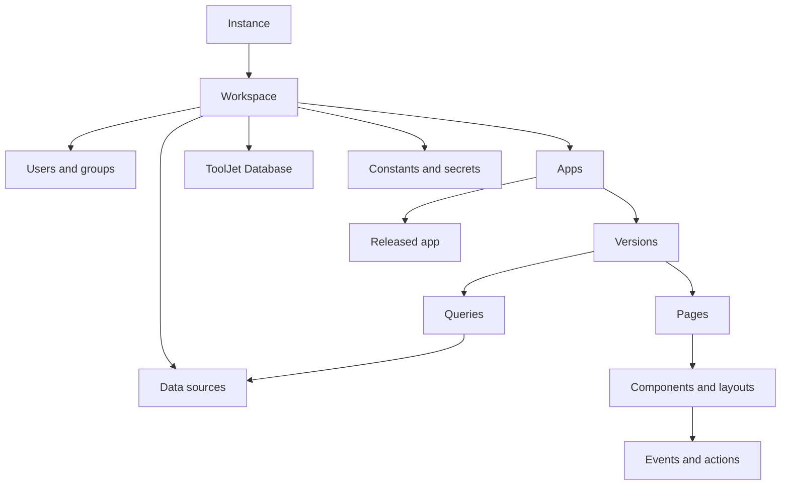

# ToolJet public product map

## Scope and evidence

This map describes the product represented by the public ToolJet repository, with emphasis on Community Edition (CE) code under `frontend/src/`, `server/src/`, and `plugins/`. Private edition implementations under the `frontend/ee` and `server/ee` submodules were not inspected. A capability appearing in the public interface does not by itself establish CE availability; edition- or license-dependent behavior is called out explicitly.

Primary evidence: `README.md`, `UBIQUITOUS_LANGUAGE.md`, root and nested `AGENTS.md` files, and the referenced implementation paths.

## Product purpose

ToolJet is a low-code platform for building and deploying internal applications. Builders assemble pages from components, connect them to data sources through queries, add events and actions, and release applications for end users. The repository also provides a built-in database, workspace/user administration, connector plugins, deployment assets, and an automation/workflow framework (`README.md`; `frontend/src/AppBuilder/`; `server/src/modules/app/module.ts::AppModule.register`).

## Users and roles

| User | Product responsibility | Evidence |
|---|---|---|
| Super Admin | Operates an instance and its workspaces and settings. | `UBIQUITOUS_LANGUAGE.md`; `server/src/modules/instance-settings/` |
| Admin | Manages one workspace, its users, settings, and resources. | `UBIQUITOUS_LANGUAGE.md`; `server/src/modules/organizations/`; `server/src/modules/organization-users/` |
| Builder | Creates apps, components, data sources, and queries, subject to permissions. | `UBIQUITOUS_LANGUAGE.md`; `frontend/src/AppBuilder/`; `server/src/modules/group-permissions/` |
| End User | Views and interacts with released apps to which they have access. | `UBIQUITOUS_LANGUAGE.md`; `frontend/src/ViewerApp.jsx::ViewerApp` |
| Application/API client | Opens a public or embedded app, or invokes an authorized outward-facing endpoint. | `server/src/modules/apps/controller.ts::AppsController`; `server/src/modules/external-apis/` |

## Product model

`Organization` and `organizationId` in code mean Workspace in the product vocabulary (`UBIQUITOUS_LANGUAGE.md`).

## Core capabilities

| Capability | What users can do | Implementation evidence |
|---|---|---|
| Visual app building | Create multi-page apps, arrange components, configure properties/styles, bind dynamic values, and connect events to actions. | `frontend/src/AppBuilder/AppCanvas/`; `frontend/src/AppBuilder/WidgetManager/`; `server/src/modules/apps/services/{page,component,event}.service.ts` |
| Components and runtime state | Use built-in UI components whose values can reference queries, components, globals, variables, constants, and secrets through `{{ }}` expressions. | `frontend/src/AppBuilder/_stores/`; `frontend/AGENTS.md` resolution pipeline; `server/src/modules/apps/services/widget-config/` |
| Data sources and queries | Configure workspace- or app-level connectors, create parameterized queries, preview/run them, and bind results into apps. | `plugins/packages/`; `server/src/modules/data-sources/`; `server/src/modules/data-queries/`; `frontend/src/AppBuilder/QueryManager/` |
| Built-in database | Create and alter tables, manage columns/foreign keys, upload CSV data, query and mutate rows, and join tables. | `server/src/modules/tooljet-db/controller.ts::TooljetDbController`; `frontend/src/TooljetDatabase/` |
| App lifecycle | Create versions, edit in an environment, release a selected version, roll back by releasing an earlier version, and import/export app definitions. | `server/src/modules/versions/`; `server/src/modules/apps/service.ts::release`; `server/src/modules/apps/services/app-import-export.service.ts` |
| Sharing and consumption | Access released apps by slug, make an app public, embed it, or require authenticated app access. | `frontend/src/ViewerApp.jsx`; `server/src/modules/apps/controller.ts::{validateReleasedAppAccess,appFromSlug}` |
| Workspace administration | Authenticate users, switch workspace, manage membership, roles/groups, folders, constants, environments, and settings. | `server/src/modules/auth/`; `server/src/modules/session/`; `server/src/modules/group-permissions/`; `frontend/src/modules/WorkspaceSettings/` |
| Extensibility and deployment | Use built-in connector packages, marketplace plugins, and self-host through Docker, Kubernetes, Helm, or OpenShift assets. | `plugins/package.json`; `marketplace/`; `docker/`; `deploy/` |
| Workflows and AI surfaces | Public base modules and UI/docs exist for workflow execution and AI-assisted building. Availability and concrete implementations vary by edition/license; several CE workflow webhook methods are stubs. | `server/src/modules/workflows/`; `server/src/modules/ai/`; `server/src/modules/workflows/controllers/workflow-webhooks.controller.ts` |

## Important user journeys

### 1. Sign in and enter a workspace

1. A user signs in through password, Google, or GitHub flows implemented in CE; other SSO providers have public stubs and private implementations (`server/src/modules/auth/AGENTS.md`).
2. `AuthController.login` calls `AuthService.login` (`server/src/modules/auth/controller.ts`, `service.ts`).
3. `SessionUtilService.generateLoginResultPayload` signs the session and sets the `tj_auth_token` cookie (`server/src/modules/session/util.service.ts`).
4. The frontend calls workspace authorization and loads role/permission context (`frontend/src/_helpers/authorizeWorkspace.js`; `frontend/src/App/App.jsx`).

### 2. Build a data-backed app

1. A Builder creates an app from the dashboard (`frontend/src/HomePage/HomePage.jsx::createApp`; `AppsController.create`).
2. The backend transaction creates the App and initial Version/environment metadata (`AppsService.create`; `AppsUtilService.create`).
3. The Builder adds Pages and Components through the App-Builder; the server persists version-scoped pages, components, layouts, and events (`frontend/src/AppBuilder/`; `server/src/modules/apps/services/`).
4. The Builder configures a Data Source and Query (`server/src/modules/data-sources/`; `DataQueriesController.create`).
5. A preview run resolves environment-specific credentials and templates and invokes the selected connector (`DataQueriesUtilService.runQuery`).

### 3. Release and use an app

1. The Builder selects a Version and releases it (`AppsController.releaseVersion` → `AppsService.release`).
2. Release validates the target environment and applicable module/version rules, then updates the released version.
3. An End User visits `/applications/:slug/:pageHandle?` (`frontend/src/RootRouter.jsx`; `ViewerApp.jsx`).
4. Access guards allow the released public app anonymously or enforce private-app permissions (`server/src/modules/apps/guards/`).
5. `Viewer` hydrates the released pages, components, events, and queries and renders `AppCanvas` (`frontend/src/AppBuilder/Viewer/Viewer.jsx`; `_hooks/useAppData.js`).

### 4. Manage and use ToolJet Database

1. An authorized user creates a workspace table through `TooljetDbController.createTable`.
2. `TooljetDbTableOperationsService` applies schema operations to the ToolJet DB PostgreSQL connection and records table metadata through `InternalTable`.
3. App queries use table IDs; `PostgrestProxyService` maps them to workspace-scoped tables, issues a scoped JWT, and forwards row operations to PostgREST.

## Confirmed business rules

- A Workspace is the tenant boundary for apps, users, data sources, constants, and ToolJet Database tables (`organizationId` across entities and guards).
- Admin, Builder, and End User permissions are enforced server-side through CASL ability guards; UI visibility is not the authorization boundary (`server/src/modules/app/guards/ability.guard.ts`).
- Every backend feature route must declare module/feature metadata and an ability guard; `GuardValidator` checks this at boot (`server/src/modules/app/validators/feature-guard.validator.ts`).
- App content belongs to a Version; non-workflow app name, slug, icon, and public state are stored on version rows (`server/src/modules/apps/AGENTS.md`).
- End users consume a released version. A public app can bypass login, but query execution remains guarded and throttled (`QueryAuthGuard`; `AppScopedThrottlerGuard`).
- Query credentials and constants are resolved for the selected Environment on the server; secrets are decrypted there rather than exposed to the browser (`server/src/modules/data-queries/util.service.ts`).
- Component configuration must remain backward compatible with previously saved apps, and server/frontend component defaults must change together (`frontend/AGENTS.md`; `server/AGENTS.md`).
- Feature availability may be constrained by edition, license terms, and resource-count guards (`server/src/modules/licensing/`; `AbilityGuard`).

## Inferences

- **Inference:** The public repository is intentionally both the CE implementation and the stable contract/base layer extended by private editions. Evidence: dynamic module selection in `SubModule.getProviders` and the documented edition inheritance/composition patterns in `AGENTS.md`.
- **Inference:** The App + Version aggregate is the dominant product boundary because pages, components, events, queries, release state, and most access checks converge on it.
