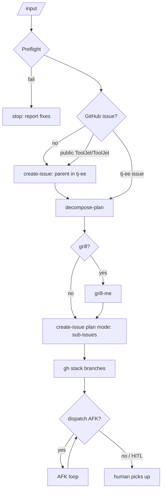

# Kickoff

Kickoff coordinates the other skills and doesn't reimplement them. Each step below invokes a skill, and there is a user gate between every step that files, pushes, or dispatches.



## 0. Preflight

Run every check and report all failures in one message:

```bash
gh --version                                   # >= 2.60
gh auth status                                 # scopes: repo, read:org
gh repo view ToolJet/tj-ee --json name -q .name
gh stack --help >/dev/null                     # gh extension install github/gh-stack
ls -L .claude/skills/create-issue/SKILL.md     # frontend/ee checked out
```

The following two checks are needed only before dispatching subagents (step 5):
- a root `.env` or `.env.test` exists;
- `createdb` is on `PATH`.

## 1. Anchor issue

Kickoff never plans without an issue, and every issue lives in `ToolJet/tj-ee`.

| Input | Action |
|---|---|
| `ToolJet/tj-ee` issue number or URL | Use it as the parent |
| `ToolJet/ToolJet` issue | Invoke `create-issue` to file a tj-ee parent that links the public URL. Private sub-issues never go under a public parent |
| PRD, file, or text | Invoke `create-issue` (Task or Feature) to file the parent, then continue |

## 2. Plan

Invoke `decompose-plan` with the parent. It ends only when the user has explicitly approved the slices, and it writes `.agents/plans/<parent#>-<slug>.md`.

## 3. Grill (optional)

Ask: "Plan approved. Grill it before filing?" If yes, invoke `grill-me` on the plan file, then re-confirm any slice the grill changed.

## 4. File and branch

1. Invoke `create-issue` in plan mode (`frontend/ee/.agents/skills/create-issue/references/plan-mode.md`). It does one approval, files sub-issues blockers-first with a native parent, type and blocked-by, and posts the plan on the parent.
2. Rename the plan's placeholder branches to `<type>/<issue#>-<slug>`.
3. Create the stacks: `references/stacks.md`.
4. Print a summary table: issue, title, mode, blocked by, stack and branch.

## 5. Implement

Ask: "N AFK sub-issues are ready. Dispatch subagents?" The user picks all, some, or none. Then follow `references/afk-loop.md`.
- HITL sub-issues are never dispatched. List them for a human.
- App Builder slices go through `app-builder-feature` or `app-builder-bug-fix`, whether a human or an agent picks them up.

## Rules

- Gates are never implied. Filing, pushing, opening PRs, and dispatching each need an explicit yes.
- Issues are append-only. Kickoff comments on issues and never edits a body it didn't write.
- If the user stops after any step, the state is still valid: the plan file, the issues and the branches stand alone.
- Nothing about a private (EE) change goes into public PR bodies or the public tracker. See the public/private boundary in `AGENTS.md`.
