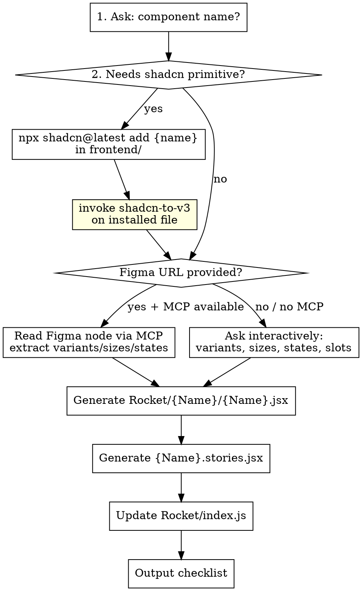

# create-rocket-component

## Overview

Interactive workflow for adding a component to the Rocket design system. Handles shadcn install, Tailwind v3 conversion, variant collection (via Figma MCP or prompts), HOC generation, and stories — in the correct order, with the correct patterns.

**Required sub-skill:** `shadcn-to-v3` — MUST run after every shadcn install.

---

## Workflow



---

## Step 1 — Determine if shadcn primitive is needed

**Use shadcn primitive for:** Select, Dialog, Dropdown, Tooltip, Popover, Sheet, Tabs, Accordion, Command, Combobox, DatePicker — anything Radix-backed with complex keyboard/accessibility behaviour.

**Skip shadcn for:** Button, Badge, Label, Spinner, Avatar, Divider — anything that's just a styled element with no Radix state machine.

If unsure: check `https://ui.shadcn.com/docs/components/{name}`.

---

## Step 2 — Install shadcn primitive (if needed)

```bash
cd frontend && npx shadcn@latest add {name}
```

Verify file landed at `src/components/ui/Rocket/shadcn/{name}.jsx`.
If it went elsewhere, the `components.json` `"ui"` alias is wrong — fix Task 0.7 in the foundation setup first.

**IMMEDIATELY invoke `shadcn-to-v3`** on the installed file before doing anything else.

Also check: `git diff frontend/src/styles/globals.css`
If shadcn added CSS vars there → copy only the new `--var: value` lines to `componentdesign.scss` under `:root {}` and `.dark-theme {}`, then revert `globals.css`.

---

## Step 3 — Collect variants and states

### Option A: Figma MCP (preferred)

Ask: *"Do you have a Figma node URL for this component?"*

If yes, use the Figma MCP to read the node. Extract:
- **Variants** (e.g. Type=Primary, Type=Secondary)
- **Sizes** (e.g. Size=SM, Size=MD, Size=LG)
- **States** (e.g. State=Default, State=Hover, State=Disabled, State=Loading)
- **Slots** (leading icon, trailing icon, prefix text, etc.)
- **Prop names** as ToolJet would express them (map Figma names → code-friendly names)

### Option B: Interactive prompts (fallback)

Ask in sequence — wait for each answer before asking the next:

1. *"What are the visual variants?"* (e.g. primary, secondary, outline, ghost, danger)
2. *"What sizes?"* (e.g. sm, default, lg — or none if single size)
3. *"What states apply?"* disabled / loading / error / success — pick all that apply
4. *"Any icon slots or special features?"* leading icon, trailing icon, clearable, counter, etc.

---

## Step 4 — Generate the HOC

See `hoc-template.md` for the full template.

**Critical rules — enforce these, they were the failure modes in PR #14498:**

| Rule | Wrong | Right |
|---|---|---|
| Token classes | `tw-bg-primary` | `tw-bg-button-primary` |
| Tailwind modifier | `tw-hover:bg-red` | `hover:tw-bg-red` |
| Important syntax | `tw-h-8!` | `!tw-h-8` |
| File path | `components/ui/Select.jsx` | `components/ui/Rocket/Select/Select.jsx` |
| CVA className override | passed inside CVA call | passed via `cn(variants({...}), className)` |
| disabled: modifier | `tw-disabled:opacity-50` | `disabled:tw-opacity-50` |
| Dark mode | body class check / MutationObserver | `dark:tw-*` Tailwind modifier |

**File path:** `frontend/src/components/ui/Rocket/{Name}/{Name}.jsx`

---

## Step 5 — Generate stories

See `story-template.md` for the full template.

**Rules:**
- Title: `'Rocket/{Name}'`
- Tags: `['autodocs']`
- One named export per variant (e.g. `export const Primary`, `export const Secondary`)
- One per key state: `Disabled`, `Loading` (if applicable)
- One `AllVariants` composite story showing every variant side by side
- One `Sizes` composite story if the component has size variants
- `parameters: { layout: 'centered' }` on the default export
- Dark mode works automatically — Storybook decorator applies `.dark-theme`. No extra setup needed.

**File path:** `frontend/src/components/ui/Rocket/{Name}/{Name}.stories.jsx`

---

## Step 6 — Update barrel

Add to `frontend/src/components/ui/Rocket/index.js`:

```js
export { ComponentName, componentNameVariants } from './ComponentName/ComponentName';
```

---

## Step 7 — Output checklist

```
✅ shadcn/{name}.jsx installed + v3-converted   (if applicable)
✅ Rocket/{Name}/{Name}.jsx generated
✅ Rocket/{Name}/{Name}.stories.jsx generated
✅ Rocket/index.js updated

📋 Manual TODOs:
- [ ] Run Storybook: cd frontend && npm run storybook
- [ ] Verify all variants render correctly (light mode)
- [ ] Toggle dark background in Storybook — confirm dark: utilities respond
- [ ] Check focus ring is visible on keyboard nav
- [ ] Confirm disabled state is non-interactive (pointer-events-none)
- [ ] Check for console errors
- [ ] git add + commit: feat(rocket/{name}): add Rocket {Name} component
```
