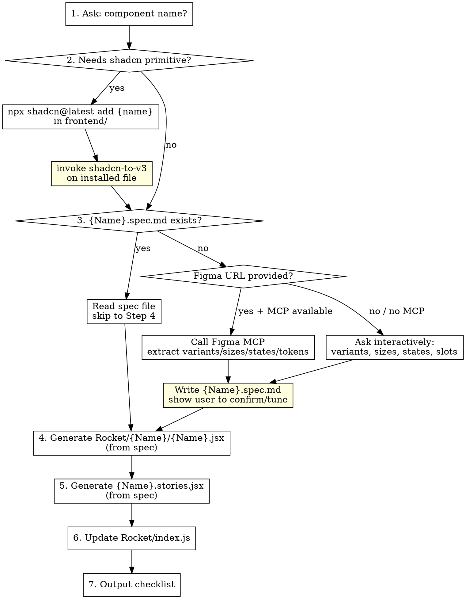

# create-rocket-component

## Overview

Interactive workflow for adding a component to the Rocket design system. The **spec file** (`{Name}.spec.md`) is the source of truth for every component — it is created once (from Figma MCP or interactive prompts), committed to the repo, and re-used on every subsequent code generation. Figma is only consulted when the spec doesn't exist yet or when a deliberate re-sync is requested.

**Required sub-skill:** `shadcn-to-v3` — MUST run after every shadcn install.

---

## Workflow



---

## Step 1 — Always install shadcn primitive

**Rule:** EVERY Rocket component MUST use a shadcn primitive as its structural base. This ensures the 3-layer architecture is consistent — shadcn handles structure (Slot, forwardRef, Radix primitives), Rocket HOC handles ToolJet token styling via CVA.

Even for "simple" components like Button, Badge, or Input where shadcn is just CVA+Slot with no Radix underneath — **still install and wrap it**. The HOC overrides all shadcn styling via `className` + tailwind-merge. This gives us:
- Consistent import pattern across every component
- shadcn handles structural concerns (asChild/Slot, accessibility attrs)
- Rocket HOC handles visual concerns (ToolJet tokens, CVA variants)
- Future shadcn upgrades (accessibility fixes, new features) flow in automatically

The only exception: components that shadcn does not provide at all (e.g. Spinner). In that case, use a plain HTML element or Radix primitive directly.

If unsure whether shadcn has a component: read `shadcn-reference.md` (co-located with this skill). Only fall back to the live shadcn website if the component isn't listed there.

---

## Step 2 — Install shadcn primitive (if needed)

```bash
cd frontend && npx shadcn@latest add {name}
```

**Registry fallback:** If the above returns a 404 ("item was not found"), the component
may only exist in the `new-york-v4` registry. Retry with the full URL:

```bash
cd frontend && npx shadcn@latest add https://ui.shadcn.com/r/styles/new-york-v4/{name}.json
```

If the install tries to overwrite existing shadcn files (e.g. button.jsx), use `--overwrite`
but immediately `git checkout` the overwritten files to restore them.

Verify file landed at `src/components/ui/Rocket/shadcn/{name}.jsx`.
If it went elsewhere, the `components.json` `"ui"` alias is wrong — fix Task 0.7 in the foundation setup first.

**IMMEDIATELY invoke `shadcn-to-v3`** on the installed file before doing anything else.

Also check: `git diff frontend/src/styles/globals.css`
If shadcn added CSS vars there → copy only the new `--var: value` lines to `componentdesign.scss` under `:root {}` and `.dark-theme {}`, then revert `globals.css`.

---

## Step 3 — Spec file: read or create

**First: check if the spec file already exists:**

```
frontend/src/components/ui/Rocket/{Name}/{Name}.spec.md
```

- **Exists → read it, skip to Step 4.** Do not call Figma MCP. Do not ask interactive questions.
- **Does not exist → create it** using Option A (Figma MCP) or Option B (interactive prompts).

---

### Option A: Create spec from Figma MCP

Ask: *"Do you have a Figma node URL for this component?"*

If yes, call **two tools in parallel:**

```
mcp__figma-desktop__get_design_context
  nodeId:           extract from URL — prefer focus-id over node-id (see below)
  artifactType:     "REUSABLE_COMPONENT"
  clientFrameworks: "react"
  clientLanguages:  "javascript,typescript"

mcp__figma-desktop__get_metadata
  nodeId:           the node-id from the URL (page/canvas level)
  clientFrameworks: "react"
  clientLanguages:  "javascript,typescript"
```

Then call separately:

```
mcp__figma-desktop__get_variable_defs
  nodeId: <same focus-id or component frame node>
```

**Extracting nodeId from a Figma URL:**
- URL format: `https://www.figma.com/design/:fileKey/:name?node-id=66-30830&focus-id=68-45650`
- `node-id=66-30830` → `66:30830` (replace `-` between the two numbers with `:`)
- `focus-id=68-45650` → `68:45650`
- **Use the `focus-id` node for `get_design_context`** — it targets the actual component frame. The `node-id` is often the page/canvas, which causes failures.
- Use the `node-id` for `get_metadata` — it returns the full page tree.

**"Too large" failure mode — sublayer strategy:**

If `get_design_context` returns sparse metadata with _"design was too large... call get_design_context on the IDs of the sublayers"_:

1. Use `get_metadata` output to find named child frames (ignore "Instance Table", "Labels", annotation frames)
2. Call `get_design_context` on each named component frame (not the canvas, not individual `<symbol>` nodes)
3. If frames are also too large, use `get_metadata` alone — semantic symbol names contain all the info needed

Individual `<symbol>` nodes always return empty from `get_design_context`. Never call it on a symbol.

**What to extract from `get_design_context`:**
- TypeScript props type → prop names and string union values
- `property1` / `Variant2` = Figma defaults when variants aren't named → resolve via metadata
- Sizes as px classNames: `size-[40px]`, `size-[32px]` → cross-ref with metadata symbol dimensions

**What to extract from `get_metadata`:**
- Symbol names encode all variant info (two naming conventions in the wild):
  - Simple: `Size=xs, State=Default`
  - Emoji-prefixed: `📏 size=large, 🖱️ state=hover, 🎚️ varient=primary, 🔞 danger?=false`
- Use `width`/`height` on each symbol to map unsemantic `VariantN` → semantic label

**Figma naming → code props:**

| Figma pattern | Code prop | Notes |
|---|---|---|
| `Size=xs/sm/md/lg` / `size=small/medium/large/default` | `size` | Direct prop values |
| `varient=primary/secondary/ghost/outline` | `variant` | Note: Figma file has typo "varient" |
| `danger?=true/false` | `danger` | Boolean prop |
| `State=hover/pressed/focus` | not a prop | CSS: `hover:`, `active:`, `focus-visible:` |
| `State=rest (default)` | not a prop | Same as `default` — Figma uses both spellings |
| `State=disabled` | `disabled` | boolean prop + HTML attr |
| `State=loading` | `loading` | boolean prop |
| `State=Error` | `status` | `'error'` variant value |

**What to extract from `get_variable_defs`:**
- Returns `{ 'token/path': '#hexvalue' }` — slash-separated, lowercase paths
- Color tokens: `button/primary → #4368e3` — maps to `tw-bg-button-primary`
- Font tokens: `Font(family: "IBM Plex Sans", style: Medium, size: 14, ...)` — string, not hex
- Effect tokens: `Effect(type: DROP_SHADOW, ...)` — string, not hex
- Do not use raw hex values in the HOC — find the matching ToolJet token class

**After extracting all data, write the spec file (see format below), then show it to the user to confirm or correct before proceeding.**

---

### Option B: Create spec from interactive prompts (fallback)

Ask in sequence — wait for each answer before asking the next:

1. *"Does this component have visual variants?"* (e.g. primary, secondary, outline — or **none**)
2. *"Does this component have size variants?"* (e.g. sm, default, lg — or **none**)
3. *"What interactive states apply?"* disabled / loading / error — pick all that apply (or none)
4. *"Any icon slots or special features?"* leading icon, trailing icon, clearable, counter, etc.
5. *"Any boolean modifier props?"* (e.g. `danger`, `fullWidth`, `rounded`)

**"None" is a valid answer for 1 and 2.**

After collecting answers, write the spec file (see format below) and show it to the user to confirm before proceeding.

---

### Spec file format

**Path:** `frontend/src/components/ui/Rocket/{Name}/{Name}.spec.md`

```markdown
# {Name} — Rocket Design Spec
<!-- figma: https://www.figma.com/design/... -->
<!-- synced: YYYY-MM-DD -->

## Props

| Prop | Type | Values | Default |
|---|---|---|---|
| variant | string | primary \| secondary \| ghost \| outline | primary |
| size | string | large \| default \| medium \| small | default |
| danger | boolean | — | false |
| disabled | boolean | — | false |
| loading | boolean | — | false |

## Sizes

| Value | Height | Tailwind |
|---|---|---|
| large | 40px | tw-h-10 |
| default | 32px | tw-h-8 |
| medium | 28px | tw-h-7 |
| small | 20px | tw-h-5 |

## Token Mapping

| Element | State | Figma token | ToolJet class |
|---|---|---|---|
| background | default | button/primary | tw-bg-button-primary |
| background | hover | button/primary-hover | hover:tw-bg-button-primary-hover |
| background | danger | button/danger-primary | tw-bg-button-danger-primary |
| text | default | text/on-solid | tw-text-on-solid |
| border | focus | Interactive/focusActive | focus-visible:tw-ring-interactive-focus |

## Slots

- leading icon (optional, `ReactNode`)
- label (required, `string`)
- trailing icon (optional, `ReactNode`)

## CVA Shape

Shape A — variants + sizes   (delete rows that don't apply)
Shape B — variants only
Shape C — sizes only
Shape D — no CVA (static classes)
Shape E — compound/multi-part (list sub-components and which need CVA vs static cn())

## Notes

- Any special rules, exceptions, or decisions not captured above
```

**Rules for writing the spec:**
- Only include props that actually appear in Figma or were confirmed by the user
- Omit sections that don't apply (e.g. no Sizes section if there are no size variants)
- Token Mapping: list only tokens confirmed by `get_variable_defs` or known ToolJet tokens — no guessing
- CVA Shape: pick one, delete the others

---

### Re-syncing spec from Figma

When the user says *"update the {Name} spec from Figma"* or *"sync spec with Figma"*:

1. Read the existing spec file
2. Re-run the Figma MCP calls (same tools as Option A)
3. Show a diff of what changed vs the current spec
4. Ask the user to confirm before overwriting
5. Write the updated spec — do not regenerate HOC or stories unless explicitly asked

---

## Step 4 — Generate the HOC

**Read `{Name}.spec.md` first.** Use the CVA Shape, Props, Sizes, and Token Mapping tables to generate the HOC. Do not rely on memory of prior Figma calls.

See `hoc-template.md` for the full template.

**Choose the CVA shape from the spec:**

| CVA Shape | Has variants? | Has sizes? | Notes |
|---|---|---|---|
| A | Yes | Yes | full CVA with `variants` and `size` keys |
| B | Yes | No | omit `size` from CVA, destructuring, PropTypes |
| C | No | Yes | omit `variant` from CVA, destructuring, PropTypes |
| D | No | No | no CVA; static `cn()` call; export `[name]Classes` constant |
| E | n/a | n/a | compound/multi-part (e.g. Combobox, Select, InputGroup) — multiple wrappers, shared context, re-exports |

**Critical rules — enforce these, they were the failure modes in prior work:**

| Rule | Wrong | Right |
|---|---|---|
| Token classes | `tw-bg-primary` | `tw-bg-button-primary` |
| Tailwind modifier | `tw-hover:bg-red` | `hover:tw-bg-red` |
| Important syntax | `tw-h-8!` | `!tw-h-8` |
| File path | `components/ui/Select.jsx` | `components/ui/Rocket/Select/Select.jsx` |
| CVA className override | passed inside CVA call | passed via `cn(variants({...}), className)` |
| disabled: modifier | `tw-disabled:opacity-50` | `disabled:tw-opacity-50` |
| Dark mode | body class check / MutationObserver | `dark:tw-*` Tailwind modifier |
| Missing border-style | `tw-border-border-default` (invisible) | `tw-border-solid tw-border-border-default` (preflight is off) |
| forwardRef on render targets | plain function component | `forwardRef` — required for Base UI `render` prop targets |
| Base UI collection API | static `<Item>` children (no filtering/selection) | `items` prop on root + render function on List |
| Dropdown width | anchors to trigger button (narrow) | anchor context ref on full-width wrapper |

### Compound component rules (Shape E)

These rules apply when wrapping shadcn components that export multiple sub-components:

1. **forwardRef on EVERY styled wrapper** — Radix uses `React.cloneElement` with refs internally. A missing `forwardRef` silently breaks features (selection, value updates, focus management, positioning). This was the root cause of Combobox selection not working: `InputGroupInput` didn't forward its ref → Base UI couldn't register the input element → `inputInsidePopup` stayed `true` → input value was never filled after selection. **Exception:** purely structural re-exports (Root, Group, Portal, Sub, RadioGroup) don't need a wrapper at all — just re-export them directly. Only add `forwardRef` wrappers on sub-components where you're overriding className with ToolJet tokens.

2. **Re-export structural-only parts directly** — Sub-components that have no visual tokens to override (Root, Trigger, Group, Portal, Sub, RadioGroup) should be re-exported as-is from shadcn. Don't wrap them in a forwardRef HOC unnecessarily. Example: `const DropdownMenu = ShadcnDropdownMenu;` or `export { DropdownMenuGroup } from './shadcn/dropdown-menu';`.

3. **Anchor context — only when trigger ≠ desired anchor** — Base UI's Positioner anchors to the Trigger element by default. This is correct for most components (DropdownMenu, Tooltip, Popover — the trigger IS the click target). Only create a `createContext` + `useRef` anchor pattern when the trigger is a small sub-element but the dropdown should match a larger wrapper's width. Real example: Combobox — the trigger is a chevron button (~28px) but the dropdown should match the full InputGroup width, so we pass an anchor ref from Root → InputGroup wrapper → Content's `anchor` prop.

4. **Use the `items` collection API** for filterable/selectable components — pass `items` prop on root, render function child `{(item) => <Item>}` on List. This enables Base UI's built-in filtering, selection tracking, and empty state detection. Without `items`, Base UI operates in composition mode where `filteredItems` is always `[]`. **Not needed for:** action menus (DropdownMenu), tooltips, dialogs — only for components with search/filter/selection.

5. **`tw-border-solid` is required** — Tailwind preflight is disabled (`corePlugins: { preflight: false }`), so `border-style` defaults to `none`. Always include `tw-border-solid` alongside border color/width classes.

6. **Override InputGroup modifiers exactly** — `tailwind-merge` only resolves conflicts when modifier strings are identical. `focus-within:tw-ring-2` does NOT conflict with `has-[[data-slot=input-group-control]:focus-visible]:tw-ring-2`. Use InputGroup's exact modifier strings to override.

### Decision guide: when to use context/refs vs simple re-exports

| Component type | Anchor context? | Items API? | forwardRef wrappers? |
|---|---|---|---|
| **Action menu** (DropdownMenu) | No — Radix auto-anchors to Trigger | No — not filterable | Only on styled sub-components |
| **Tooltip / Popover** | No — anchors to Trigger naturally | No | Only on Content |
| **Select** (non-searchable) | No — Trigger is full-width already | No | Only on styled sub-components |
| **Combobox** (searchable) | YES — chevron trigger ≠ full input width | YES — needs filtering | On ALL render targets |
| **Dialog / Sheet** | No — no anchor needed | No | Only on Content/Overlay |

**File path:** `frontend/src/components/ui/Rocket/{Name}/{Name}.jsx`

---

## Step 5 — Generate stories

**Read `{Name}.spec.md` first.** Use the Props and CVA Shape to determine which stories to generate.

See `story-template.md` for the full template.

**Rules:**
- Title: `'Rocket/{Name}'`
- Tags: `['autodocs']`
- One named export per variant (e.g. `export const Primary`, `export const Secondary`) — **skip if no variants**
- One per key state: `Disabled`, `Loading` — **only if those states exist in spec**
- One `AllVariants` composite story showing every variant side by side — **skip if no variants**
- One `Sizes` composite story showing every size — **skip if no size variants**
- If neither variants nor sizes exist: just one `Default` story
- `parameters: { layout: 'centered' }` on the default export
- Dark mode works automatically — Storybook decorator applies `.dark-theme`. No extra setup needed.

**File path:** `frontend/src/components/ui/Rocket/{Name}/{Name}.stories.jsx`

---

## Step 6 — Update barrel

Add to `frontend/src/components/ui/Rocket/index.js`:

```js
export { ComponentName, componentNameVariants } from './ComponentName/ComponentName';
```

---

## Step 7 — Output checklist

```
✅ shadcn/{name}.jsx installed + v3-converted   (if applicable)
✅ Rocket/{Name}/{Name}.spec.md written + confirmed
✅ Rocket/{Name}/{Name}.jsx generated
✅ Rocket/{Name}/{Name}.stories.jsx generated
✅ Rocket/index.js updated

📋 Manual TODOs:
- [ ] Run Storybook: cd frontend && npm run storybook
- [ ] Verify all variants render correctly (light mode)
- [ ] Toggle dark background in Storybook — confirm dark: utilities respond
- [ ] Check focus ring is visible on keyboard nav
- [ ] Confirm disabled state is non-interactive (pointer-events-none)
- [ ] Check for console errors
- [ ] git add + commit: feat(rocket/{name}): add Rocket {Name} component
```
