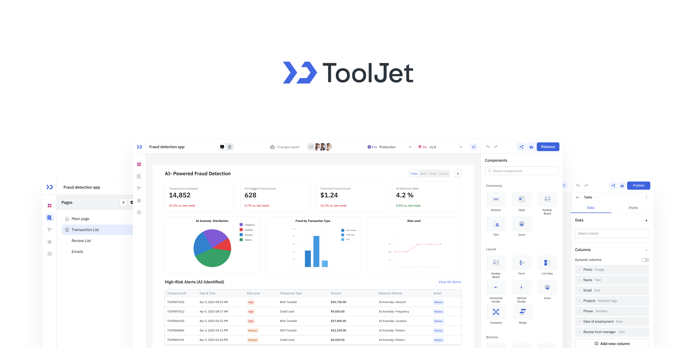
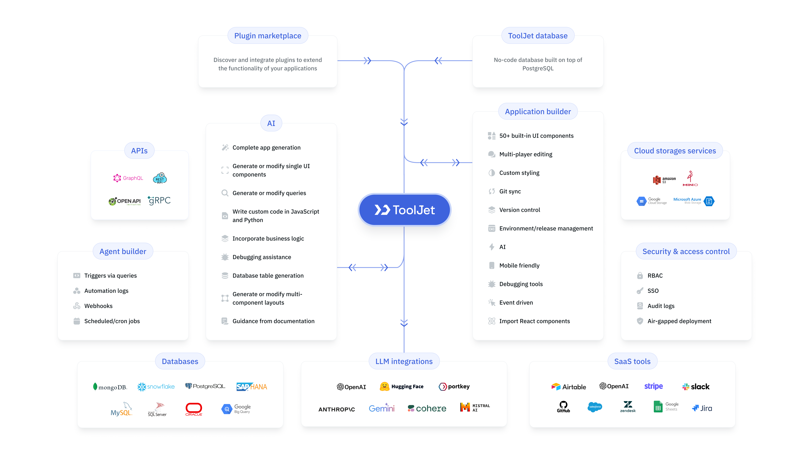

ToolJet is the open-source foundation of ToolJet AI - the AI-native platform for building and deploying internal tools, workflows and AI agents. The community edition provides a powerful visual builder, drag-and-drop UI, and integrations with databases, APIs, SaaS apps, and object storage. For AI-powered UI generation, query building, debugging, and enterprise features, see ToolJet AI.

 :star: If you find ToolJet useful, please consider giving us a star on GitHub! Your support helps us continue to innovate and deliver exciting features.


[](https://github.com/ToolJet/ToolJet/issues)
[](https://github.com/ToolJet/ToolJet/stargazers)


[](https://github.com/ToolJet/ToolJet)
[](https://twitter.com/ToolJet)

<p align="center">
    
</p>

<p align="center">
    
</p>

## Features  

### Community Edition (CE)  
- **Visual App Builder:** 60+ responsive components (Tables, Charts, Forms, Lists, Progress Bars, and more).  
- **ToolJet Database:** Built-in no-code database.  
- **Multi-page Apps & Multiplayer Editing:** Build complex apps collaboratively.  
- **75+ Data Sources:** Connect to databases, APIs, cloud storage, and SaaS tools.  
- **Flexible Deployment:** Self-host with Docker, Kubernetes, AWS, GCP, Azure, and more.  
- **Collaboration Tools:** Inline comments, mentions, and granular access control.  
- **Extensibility:** Create plugins and connectors with the [ToolJet CLI](https://www.npmjs.com/package/@tooljet/cli).  
- **Code Anywhere:** Run JavaScript and Python inside your apps.  
- **Secure by Design:** AES-256-GCM encryption, proxy-only data flow, SSO support.  

### ToolJet AI (Enterprise)  
Everything in CE, plus:  
- **AI App Generation:** Create apps instantly from natural language prompts.  
- **AI Query Builder:** Generate and transform queries with AI assistance.  
- **AI Debugging:** Identify and fix issues with one click.  
- **Agent Builder:** Create intelligent agents to automate workflows and orchestrate processes.  
- **Enterprise-grade Security & Compliance:** SOC 2 and GDPR readiness, audit logs, and advanced access control.
- **User Management:** Role-based access (RBAC), custom groups, and granular app/data permissions.  
- **Multi-environment Management:** Seamless dev/stage/prod environments.  
- **GitSync & CI/CD:** Integrate with GitHub/GitLab for version control and streamlined deployments.  
- **Branding & Customization:** White-labeling, and custom theming for organizational branding.  
- **Fine-Grained Access Control:** Secure data and actions at the row, component, page, and query levels.  
- **Embedded Apps:** Embed ToolJet apps securely within other applications or portals.  
- **Enterprise Support:** SLAs, priority bug fixes, and onboarding assistance.  

<hr>

## Quickstart
The easiest way to get started with ToolJet is by creating a [ToolJet Cloud](https://tooljet.ai) account. ToolJet Cloud offers a hosted solution of ToolJet. If you want to self-host ToolJet, kindly proceed to [deployment documentation](https://docs.tooljet.ai/docs/setup/).

### Try using Docker
Want to give ToolJet a quick spin on your local machine? You can run the following command from your terminal to have ToolJet up and running right away.


```bash
docker run \
  --name tooljet \
  --restart unless-stopped \
  -p 80:80 \
  --platform linux/amd64 \
  -v tooljet_data:/var/lib/postgresql/13/main \
  tooljet/try:ee-lts-latest
```

*For users upgrading their ToolJet version, we recommend choosing the LTS version over the latest version. The LTS version ensures stability with production bug fixes, security patches, and performance enhancements.*

## Tutorials and examples

[Time Tracker Application](https://docs.tooljet.ai/docs/#quickstart-guide)<br>
[Build your own CMS using low-code](https://blog.tooljet.ai/build-cms-using-lowcode-and-mongodb/)<br>
[AWS S3 Browser](https://blog.tooljet.ai/build-an-aws-s3-broswer-with-tooljet/)<br>

## Documentation
Documentation is available at https://docs.tooljet.ai.

- [Getting Started](https://docs.tooljet.ai)<br>
- [Data source Reference](https://docs.tooljet.ai/docs/data-sources/airtable/)<br>
- [Component Reference](https://docs.tooljet.ai/docs/widgets/button)

## Self-hosted
You can use ToolJet Cloud for a fully managed solution. If you want to self-host ToolJet, we have guides on deploying ToolJet on Kubernetes, AWS EC2, Docker, and more.

| Provider  | Documentation |
| :------------- | :------------- |
| Digital Ocean | [Link](https://docs.tooljet.ai/docs/setup/digitalocean)  |
| Docker  | [Link](https://docs.tooljet.ai/docs/setup/docker)   |
| AWS EC2 | [Link](https://docs.tooljet.ai/docs/setup/ec2)  |
| AWS ECS | [Link](https://docs.tooljet.ai/docs/setup/ecs)   |
| OpenShift | [Link](https://docs.tooljet.ai/docs/setup/openshift)   |
| Helm | [Link](https://docs.tooljet.ai/docs/setup/helm)   |
| AWS EKS (Kubernetes) | [Link](https://docs.tooljet.ai/docs/setup/kubernetes)   |
| GCP GKE (Kubernetes) | [Link](https://docs.tooljet.ai/docs/setup/kubernetes-gke)   |
| Azure AKS (Kubernetes) | [Link](https://docs.tooljet.ai/docs/setup/kubernetes-aks)   |
| Azure Container | [Link](https://docs.tooljet.ai/docs/setup/azure-container)   |
| Google Cloud Run  | [Link](https://docs.tooljet.ai/docs/setup/google-cloud-run)   |
| Deploying ToolJet client  | [Link](https://docs.tooljet.ai/docs/setup/client)   |
| Deploying ToolJet on a Subpath  | [Link](https://docs.tooljet.ai/docs/setup/tooljet-subpath/)   |

## Marketplace 
ToolJet can now be found on both AWS and Azure Marketplaces, making it simpler than ever to access and deploy our app-building platform.

Find ToolJet on AWS Marketplace [here](https://aws.amazon.com/marketplace/pp/prodview-fxjto27jkpqfg?sr=0-1&ref_=beagle&applicationId=AWSMPContessa) and explore seamless integration on Azure Marketplace [here](https://azuremarketplace.microsoft.com/en-us/marketplace/apps/tooljetsolutioninc1679496832216.tooljet?tab=Overview).

## Community support
For general help using ToolJet, please refer to the official [documentation](https://docs.tooljet.ai/docs/). For additional help, you can use one of these channels to ask a question:

- [Slack](https://tooljet.ai/slack) - Discussions with the community and the team.
- [GitHub](https://github.com/ToolJet/ToolJet/issues) - For bug reports and feature requests.
- [𝕏 (Twitter)](https://twitter.com/ToolJet) - Get the product updates quickly.

## Roadmap
Check out our [roadmap](https://github.com/orgs/ToolJet/projects/15) to stay updated on recently released features and learn about what's coming next.

## Branching model
We use the git-flow branching model. The base branch is `develop`. If you are looking for a stable version, please use the main branch or tags labeled as v1.x.x.

## Contributing
Kindly read our [Contributing Guide](CONTRIBUTING.md) to familiarize yourself with ToolJet's development process, how to suggest bug fixes and improvements, and the steps for building and testing your changes. <br>

## Contributors
<a href="https://github.com/tooljet/tooljet/graphs/contributors">
  
  
</a>

## License
ToolJet © 2023, ToolJet Solutions Inc - Released under the GNU Affero General Public License v3.0.
