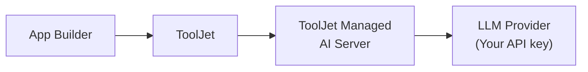

<PlanBadge type="enterprise" />

Bring Your Own Key (BYOK) vous permet de configurer une clé API d'un fournisseur LLM pris en charge directement dans les paramètres de ToolJet. Au lieu d'acheminer les requêtes IA via les identifiants gérés par ToolJet et de consommer des crédits ToolJet AI, ToolJet authentifiera toutes les requêtes IA à l'aide de votre propre clé.

Cela est utile lorsque vous souhaitez avoir un contrôle direct sur votre utilisation de l'IA et vos coûts. Puisque la clé API appartient à votre compte fournisseur LLM, vous bénéficiez d'une visibilité complète sur la consommation, pouvez définir vos propres limites de débit et plafonds de dépenses, et êtes facturé directement par le fournisseur, indépendamment de votre abonnement ToolJet.

BYOK ne nécessite aucun changement d'infrastructure. Les requêtes continuent d'être traitées via ToolJet Managed AI Server, la seule différence étant les identifiants utilisés pour les authentifier.

:::info
Les requêtes IA continuent de passer par ToolJet Managed AI Server lorsque vous utilisez BYOK. Si votre organisation exige qu'aucune donnée ne quitte votre propre infrastructure, consultez [ToolJet AI Enterprise](/docs/setup/tooljet-ai/tj-ai-enterprise).
:::

Cela signifie :

1. **Contrôle des coûts** : l'utilisation est facturée directement à votre compte fournisseur LLM. ToolJet ne facture pas de crédits ToolJet AI pour ces requêtes.
2. **Visibilité** : vous pouvez surveiller l'utilisation et définir des limites de dépenses via le tableau de bord de votre fournisseur LLM.
3. **Compatibilité** : BYOK fonctionne à la fois sur ToolJet Cloud et sur les déploiements auto-hébergés ; aucun changement d'infrastructure n'est requis de votre côté.

## Prérequis

### Anthropic

Pour utiliser Anthropic comme fournisseur LLM, une clé API Anthropic est requise. Vous pouvez suivre la [documentation officielle d'Anthropic](https://platform.claude.com/docs/en/api/overview#getting-api-keys) pour générer la clé API.

### Google Gemini

Pour utiliser Google Gemini comme fournisseur LLM, des identifiants de compte de service Vertex AI sont requis. Vous pouvez suivre la [documentation officielle](https://docs.cloud.google.com/gemini-enterprise-agent-platform/machine-learning/general/custom-service-account) pour générer les identifiants.

:::info Configurer Google Gemini via des variables d'environnement
Pour configurer Google Gemini via des variables d'environnement, vous devrez générer une chaîne en base64 pour votre JSON.
:::

## Configurer votre clé API via l'interface

1. Accédez à **Workspace Settings → LLM Key** dans votre espace de travail ToolJet.
    
2. Sélectionnez le fournisseur que vous souhaitez utiliser. Par défaut, "ToolJet managed" sera sélectionné, ce qui utilise les crédits ToolJet AI.
    
3. Ensuite, saisissez votre clé API provenant de votre fournisseur LLM (par ex. votre clé API Anthropic depuis [console.anthropic.com](https://console.anthropic.com)).
4. Cliquez sur **Save changes**.

ToolJet utilisera votre clé pour authentifier les requêtes envoyées à votre fournisseur LLM.

## Configurer votre clé API via des variables d'environnement

1. Configurez les variables d'environnement suivantes :
    1. `LLM_PROVIDER` : vous pouvez définir votre fournisseur LLM à l'aide de cette variable.
        | Valeur | Quand l'utiliser |
        |:------|:------------|
        | `anthropic` | Lorsque vous souhaitez utiliser une clé API Anthropic |
        | `gemini` | Lorsque vous souhaitez utiliser une clé API Gemini |
        | `tooljet_managed` | Lorsque vous souhaitez utiliser les crédits ToolJet AI gérés. |
    2. Définissez la variable suivante selon le fournisseur LLM que vous utilisez :
        - `ANTHROPIC_API_KEY=<your-api-key>` : si vous utilisez Anthropic.
        - `GEMINI_API_KEY=<base64-string-of-your-JSON>` : si vous utilisez Gemini.
2. Une fois les variables ci-dessus configurées, accédez à **Workspace Settings → LLM Key** dans votre espace de travail ToolJet et activez le bouton bascule "Apply configuration from environment variable".
    

## Fournisseurs pris en charge

**Actuellement, seuls Anthropic et Google Gemini (Vertex AI) sont pris en charge.** La prise en charge de fournisseurs LLM supplémentaires est prévue pour de futures versions.

## Questions fréquentes

**Serai-je toujours facturé en crédits ToolJet AI après avoir configuré BYOK ?**

Non. Une fois qu'une clé API valide est configurée, toutes les requêtes IA sont authentifiées à l'aide de votre clé et facturées directement à votre compte fournisseur LLM. Les crédits ToolJet AI ne sont pas consommés.

**Ma clé API est-elle stockée par ToolJet ?**

Votre clé API est stockée de manière sécurisée dans les paramètres de votre espace de travail ToolJet. Elle est utilisée uniquement pour authentifier les requêtes IA en votre nom.

**BYOK fonctionne-t-il si j'utilise ToolJet Cloud ?**

Oui. BYOK est compatible à la fois avec ToolJet Cloud et les déploiements auto-hébergés.

**Puis-je revenir aux crédits ToolJet AI après avoir configuré BYOK ?**

Oui. Vous pouvez supprimer votre clé API depuis **Workspace Settings → LLM Key** à tout moment pour revenir aux crédits ToolJet AI.

**Que se passe-t-il si ma clé API est invalide ou expire ?**

Les fonctionnalités basées sur l'IA ne s'exécuteront plus jusqu'à ce qu'une clé valide soit fournie. Vous devrez mettre à jour la clé dans **Workspace Settings → LLM Key**.

