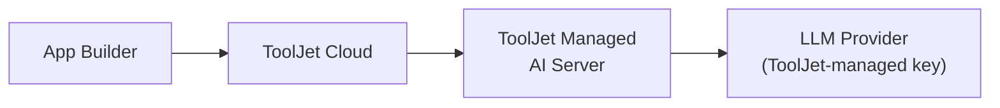

Il s'agit de la configuration IA par défaut pour tout espace de travail sur **ToolJet Cloud**. Les requêtes IA sont acheminées via ToolJet Managed AI Server et authentifiées à l'aide des identifiants LLM gérés par ToolJet, facturés sur les [crédits IA](/docs/build-with-ai/ai-credits) de votre espace de travail.

:::info
Consultez [Configurer ToolJet AI &rarr; Vue d'ensemble](/docs/setup/tooljet-ai/overview) pour comprendre comment cette configuration s'articule avec les autres configurations IA et comment la requête est traitée de bout en bout.
:::

## Prérequis

Aucun. Chaque espace de travail ToolJet Cloud dispose des fonctionnalités IA activées par défaut.

## Configuration

Aucune configuration n'est requise :

1. Connectez-vous à votre espace de travail ToolJet Cloud.
2. Commencez à utiliser n'importe quelle [capacité IA](/docs/build-with-ai/overview#ai-capabilities), par exemple générer une application ou corriger un composant avec l'IA.
3. L'utilisation est mesurée par rapport aux crédits IA mensuels et complémentaires de votre espace de travail. Vous pouvez vérifier votre consommation à tout moment sous **Settings &rarr; Subscription**.

## Facturation

Les crédits sont mutualisés au **niveau de l'espace de travail**. Consultez [Comprendre les crédits IA](/docs/build-with-ai/ai-credits) pour savoir comment la consommation est calculée et comment acheter des crédits complémentaires.

## Passer à une autre configuration

Si vous préférez utiliser votre propre clé API LLM tout en restant sur ToolJet Cloud, afin que l'utilisation soit facturée directement par votre fournisseur plutôt que de consommer des crédits IA, consultez [Configurer ToolJet Cloud AI (BYOK)](/docs/setup/tooljet-ai/bring-your-own-key).
