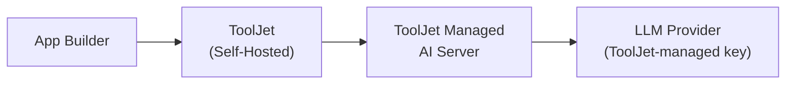

<PlanBadge type="self-hosted" />

Les instances ToolJet auto-hébergées peuvent utiliser l'IA gérée par ToolJet au lieu de déployer un serveur IA distinct. Les requêtes IA de votre instance sont envoyées via Internet vers ToolJet Managed AI Server, authentifiées avec les identifiants LLM gérés par ToolJet, et facturées sur les crédits IA de votre instance.

:::info
Consultez [Configurer ToolJet AI &rarr; Vue d'ensemble](/docs/setup/tooljet-ai/overview) pour comprendre comment cette configuration s'articule avec les autres configurations IA et comment la requête est traitée de bout en bout.
:::

## Prérequis

- Une licence ToolJet avec la fonctionnalité IA activée.
- Un accès HTTPS sortant (443) depuis votre serveur ToolJet vers ToolJet Managed AI Server.

## Autoriser l'accès réseau

Si votre instance fonctionne derrière un pare-feu, un proxy ou une politique d'egress restreinte, autorisez l'accès HTTPS sortant vers les domaines suivants :

| Domaine | Objectif |
|---|---|
| `https://api-gateway.tooljet.ai` | Achemine les requêtes IA vers le fournisseur LLM configuré |
| `https://python-server.tooljet.ai` | Prend en charge les opérations IA nécessitant le service d'exécution Python |

Si votre instance utilise un [proxy HTTP](/docs/setup/http-proxy), assurez-vous que ces domaines sont accessibles à travers celui-ci.

## Configuration

1. Confirmez que votre licence inclut des crédits IA. Si vous devez en acheter davantage, suivez les étapes **Self-Hosted Deployment** sous [Acheter des crédits complémentaires](/docs/build-with-ai/ai-credits#buy-add-on-credits).
2. Autorisez les domaines listés ci-dessus dans votre pare-feu, proxy ou règles d'egress réseau.
3. Aucune configuration supplémentaire n'est nécessaire. Les fonctionnalités IA deviennent automatiquement disponibles dans votre espace de travail, facturées sur les crédits IA mutualisés de votre instance.

## Facturation

Les crédits sont mutualisés au **niveau de l'instance** pour les déploiements auto-hébergés. Consultez [Comprendre les crédits IA](/docs/build-with-ai/ai-credits#credit-allocation) pour plus de détails.

## Passer à une autre configuration

- Pour utiliser votre propre clé API LLM tout en continuant à acheminer les requêtes via ToolJet Managed AI Server, consultez [Configurer ToolJet Cloud AI (BYOK)](/docs/setup/tooljet-ai/bring-your-own-key).
- Pour conserver tout le trafic IA entièrement au sein de votre propre infrastructure sans qu'aucune donnée ne soit envoyée à ToolJet Managed AI Server, consultez [Configurer ToolJet Enterprise AI](/docs/setup/tooljet-ai/tj-ai-enterprise).
