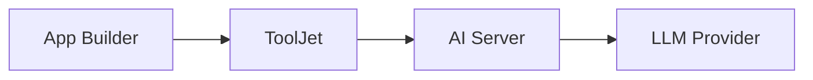
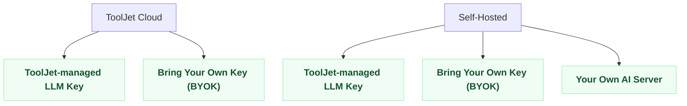

import Link from '@docusaurus/Link';

ToolJet AI peut être alimenté de différentes manières selon la façon dont ToolJet lui-même est déployé et le niveau d'exigence de résidence des données de votre organisation. Cette page explique comment une requête d'IA est traitée, compare côte à côte les configurations disponibles, et vous aide à choisir celle qui convient à votre organisation.

## Comment une requête d'IA est traitée

export const SpecGrid = ({ items }) => (
    

        {items.map(([label, value], i) => (
            

                <strong>{label}</strong>: {value}
            

        ))}
    

);

export const GuideLink = ({ href, children }) => (
    

        <Link to={href} style={{ textDecoration: 'none' }}>
            
                {children} &rarr;
            
        </Link>
    

);

À un niveau élevé, chaque requête d'IA suit le même chemin :

Lorsque vous utilisez une fonctionnalité d'IA dans le constructeur d'applications, ToolJet envoie la requête à un AI Server, qui communique avec le fournisseur LLM et renvoie la réponse. Les identifiants de vos sources de données et vos données sous-jacentes ne quittent jamais votre déploiement ; seuls le prompt, les métadonnées de l'application et le schéma nécessaires au fonctionnement de l'IA sont envoyés à l'AI Server.

ToolJet fournit son propre AI Server pour traiter ces requêtes, et celui-ci peut s'exécuter à plusieurs endroits selon votre déploiement.

## Où s'exécute l'AI Server

### AI Server géré par ToolJet

Il s'agit de l'AI Server hébergé et exploité par ToolJet. Il est utilisé par défaut, que vous soyez sur ToolJet Cloud ou en auto-hébergement, et les requêtes l'atteignent via Internet.

### Votre propre AI Server

Pour les organisations qui ont besoin d'un contrôle total sur l'endroit où s'exécutent les charges de travail d'IA, ToolJet fournit également une image de serveur que vous déployez au sein de votre propre infrastructure. Dans ce cas, l'AI Server lui-même s'exécute sur votre réseau, et aucune requête n'atteint jamais l'infrastructure de ToolJet.

## Différents types de configurations

### ToolJet Cloud

#### AI Server géré par ToolJet avec ToolJet Cloud

Il s'agit de la configuration par défaut pour tout espace de travail sur ToolJet Cloud. Les requêtes d'IA sont acheminées vers l'AI Server géré par ToolJet et authentifiées à l'aide d'identifiants LLM gérés par ToolJet, aucune configuration n'est nécessaire.

<SpecGrid items={[
    ['Déploiement ToolJet', 'ToolJet Cloud'],
    ['Requêtes acheminées via', 'AI Server géré par ToolJet'],
    ['Clé API LLM', 'Gérée par ToolJet'],
    ['Facturation', 'Crédits ToolJet AI'],
    ['Les données quittent votre réseau', 'N/A, déjà sur ToolJet Cloud'],
    ['Exigence de configuration', 'Aucune'],
]} />

<GuideLink href="/docs/setup/tooljet-ai/managed-with-cloud">Consulter le guide de configuration complet</GuideLink>

#### Utiliser votre propre clé API LLM (BYOK)

Bring Your Own Key (BYOK) vous permet de configurer votre propre clé API de fournisseur LLM au lieu d'utiliser les identifiants gérés par ToolJet. Les requêtes continuent d'être acheminées via l'AI Server géré par ToolJet, seuls les identifiants utilisés pour les authentifier changent.

<SpecGrid items={[
    ['Déploiement ToolJet', 'Cloud ou auto-hébergé'],
    ['Requêtes acheminées via', 'AI Server géré par ToolJet'],
    ['Clé API LLM', 'La vôtre'],
    ['Facturation', 'Directement auprès de votre fournisseur LLM'],
    ['Les données quittent votre réseau', 'Oui, vers l\'AI Server géré par ToolJet'],
    ['Exigence de configuration', 'Configurer votre clé API'],
]} />

<GuideLink href="/docs/setup/tooljet-ai/bring-your-own-key">Consulter le guide de configuration complet</GuideLink>

### Déploiements auto-hébergés

#### AI Server géré par ToolJet

Les instances auto-hébergées peuvent utiliser le même AI Server géré par ToolJet qui alimente ToolJet Cloud, au lieu de déployer un serveur d'IA séparé. Votre instance a besoin d'un accès réseau sortant vers l'AI Server géré par ToolJet.

<SpecGrid items={[
    ['Déploiement ToolJet', 'Auto-hébergé'],
    ['Requêtes acheminées via', 'AI Server géré par ToolJet'],
    ['Clé API LLM', 'Gérée par ToolJet'],
    ['Facturation', 'Crédits ToolJet AI'],
    ['Les données quittent votre réseau', 'Oui, vers l\'AI Server géré par ToolJet'],
    ['Exigence de configuration', 'Mise en liste blanche des domaines sortants'],
]} />

<GuideLink href="/docs/setup/tooljet-ai/managed-with-self-hosted">Consulter le guide de configuration complet</GuideLink>

#### Utiliser votre propre clé API LLM (BYOK)

Bring Your Own Key (BYOK) vous permet de configurer votre propre clé API de fournisseur LLM au lieu d'utiliser les identifiants gérés par ToolJet. Les requêtes continuent d'être acheminées via l'AI Server géré par ToolJet, seuls les identifiants utilisés pour les authentifier changent.

<SpecGrid items={[
    ['Déploiement ToolJet', 'Cloud ou auto-hébergé'],
    ['Requêtes acheminées via', 'AI Server géré par ToolJet'],
    ['Clé API LLM', 'La vôtre'],
    ['Facturation', 'Directement auprès de votre fournisseur LLM'],
    ['Les données quittent votre réseau', 'Oui, vers l\'AI Server géré par ToolJet'],
    ['Exigence de configuration', 'Configurer votre clé API'],
]} />

<GuideLink href="/docs/setup/tooljet-ai/bring-your-own-key">Consulter le guide de configuration complet</GuideLink>

#### ToolJet Enterprise AI

Pour les organisations qui ne peuvent laisser aucune requête d'IA quitter leur infrastructure, ToolJet fournit une image de serveur que vous déployez et exploitez vous-même, en utilisant votre propre clé API LLM. L'AI Server géré par ToolJet n'intervient absolument pas.

<SpecGrid items={[
    ['Déploiement ToolJet', 'Auto-hébergé uniquement'],
    ['Requêtes acheminées via', 'Votre propre AI Server'],
    ['Clé API LLM', 'La vôtre'],
    ['Facturation', 'Directement auprès de votre fournisseur LLM'],
    ['Les données quittent votre réseau', 'Non'],
    ['Exigence de configuration', 'Déployer une image de serveur séparée'],
]} />

<GuideLink href="/docs/setup/tooljet-ai/tj-ai-enterprise">Consulter le guide de configuration complet</GuideLink>

## Quelle configuration dois-je utiliser ?

:::info
Pour un aperçu complet des données partagées avec l'IA et de leur protection, consultez la [Politique de confidentialité](/docs/build-with-ai/privacy).
:::
