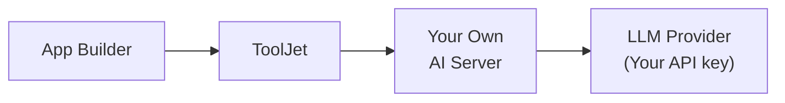

<PlanBadge type="enterprise" />
<PlanBadge type="self-hosted" />

ToolJet AI Enterprise est conçu pour les organisations qui exigent un contrôle total sur l'endroit où leurs données sont traitées. Plutôt que d'acheminer les requêtes IA via le ToolJet Managed AI Server, vous déployez une image de serveur fournie par ToolJet au sein de votre propre environnement. Toutes les charges de travail IA s'exécutent sur vos serveurs, en utilisant votre propre clé API LLM ; aucune donnée n'est transmise à ToolJet ni traitée par ToolJet, à aucun moment.

Ceci est particulièrement pertinent pour les organisations soumises à des réglementations strictes de résidence des données, à des politiques de conformité internes, ou celles qui fonctionnent dans des environnements isolés (air-gapped) ou de cloud privé où les appels réseau externes vers des serveurs tiers ne sont pas autorisés.

Avantages de ToolJet AI Enterprise :

- **Maîtrise des coûts** : L'utilisation est facturée directement sur votre compte fournisseur LLM. ToolJet ne facture pas de crédits ToolJet AI pour ces requêtes.
- **Visibilité** : Vous pouvez surveiller l'utilisation et définir des limites de dépenses via le tableau de bord de votre fournisseur LLM.
- **Isolation complète des données** : Toute l'exécution de l'IA se déroule sur une infrastructure que vous contrôlez. Les serveurs de ToolJet ne sont pas impliqués dans le traitement des requêtes.
- **Gestion flexible des clés** : Fournissez votre clé API via l'interface ToolJet ou injectez-la directement en tant que variable d'environnement sur le serveur. L'utilisation d'une variable d'environnement est préférable pour la gestion des secrets dans les déploiements automatisés ou conteneurisés.

:::info Non disponible sur ToolJet Cloud
ToolJet AI Enterprise nécessite que vous déployiez et exploitiez vous-même l'image de serveur fournie par ToolJet.
:::

## Déploiement de l'image du serveur

Veuillez contacter notre équipe de support à l'adresse [support@tooljet.com](mailto:support@tooljet.com). Elle vous aidera avec l'image du serveur et les étapes nécessaires pour la déployer.

## Configuration de votre clé API

Il existe deux méthodes pour fournir votre clé API LLM au serveur :

### Configurer via l'interface ToolJet

Cette méthode convient lorsque vous préférez une gestion centralisée des clés via l'interface ToolJet.

1. Accédez à **Workspace Settings → LLM Key** dans votre espace de travail ToolJet.
    
2. Sélectionnez le fournisseur que vous souhaitez utiliser. Par défaut, "ToolJet managed" sera sélectionné, ce qui utilise les crédits ToolJet AI.
    
3. Ensuite, saisissez votre clé API de votre fournisseur LLM (par exemple, votre clé API Anthropic depuis [console.anthropic.com](https://console.anthropic.com)).
4. Cliquez sur **Save changes**.

ToolJet transmettra en toute sécurité la clé à votre serveur lors des requêtes IA.

### Utiliser une variable d'environnement

Cette méthode est recommandée pour les déploiements en production, les pipelines CI/CD, ou les environnements où les secrets ne doivent pas être saisis via une interface.

1. Configurez les variables d'environnement suivantes :
    1. `LLM_PROVIDER` : Vous pouvez définir votre fournisseur LLM à l'aide de cette variable.
        | Valeur | Quand l'utiliser |
        |:------|:------------|
        | `anthropic` | Lorsque vous souhaitez utiliser une clé API Anthropic |
        | `gemini` | Lorsque vous souhaitez utiliser une clé API Gemini |
        | `tooljet_managed` | Lorsque vous souhaitez utiliser les crédits ToolJet Managed AI. |
    2. Définissez la variable suivante selon le fournisseur LLM que vous utilisez :
        - `ANTHROPIC_API_KEY=<your-api-key>` : Si vous utilisez Anthropic.
        - `GEMINI_API_KEY=<base64-string-of-your-JSON>` : Si vous utilisez Gemini.
2. Une fois les variables ci-dessus configurées, accédez à **Workspace Settings → LLM Key** dans votre espace de travail ToolJet et activez le bouton "Apply configuration from environment variable".
    

Le serveur lira la clé depuis l'environnement au moment de l'exécution. ToolJet ne transmettra pas la clé depuis l'interface.

## Fournisseurs pris en charge

**Actuellement, seul Anthropic est pris en charge.** La prise en charge de fournisseurs LLM supplémentaires est prévue pour les prochaines versions.

## Questions fréquentes

**Quelle est la différence entre BYOK et ToolJet AI Enterprise ?**

Avec BYOK, votre clé API est utilisée mais les requêtes sont toujours acheminées via le ToolJet Managed AI Server. Avec ToolJet AI Enterprise, vous hébergez vous-même le serveur ; aucune donnée ne quitte votre infrastructure, à aucun moment.

**ToolJet AI Enterprise est-il disponible sur ToolJet Cloud ?**

Non. ToolJet AI Enterprise nécessite que vous déployiez et exploitiez l'image de serveur fournie par ToolJet au sein de votre propre infrastructure.

**Quelle méthode de configuration de clé API dois-je utiliser ?**

Pour les déploiements en production ou automatisés, les variables d'environnement sont recommandées car elles maintiennent les secrets hors de l'interface et respectent les pratiques standard de gestion des secrets. La méthode via l'interface convient aux configurations plus simples ou aux environnements de développement.

**Que se passe-t-il si la clé de l'interface et la variable d'environnement sont configurées en même temps ?**

Lorsque le bouton **Apply configuration from environment variables** est activé, le serveur utilise la variable d'environnement et ignore toute clé saisie via l'interface.

**Puis-je utiliser ToolJet AI Enterprise dans un environnement isolé (air-gapped) ?**

Oui, à condition que l'image du serveur puisse être déployée au sein de votre réseau et que l'API de votre fournisseur LLM soit accessible depuis cet environnement.

