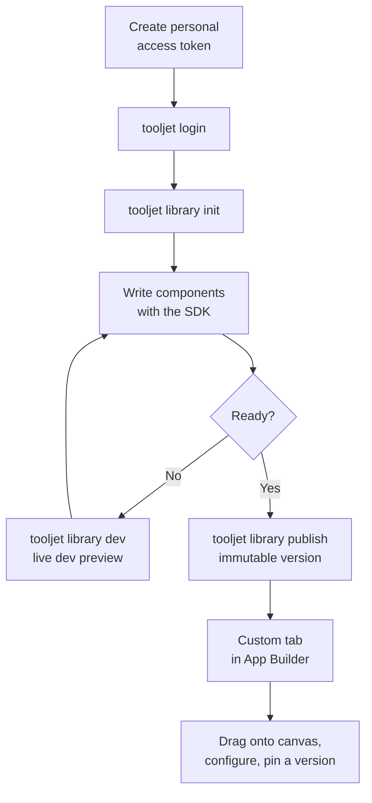

  
 Paid feature

**Custom Component Libraries** let you write React components on your machine, publish them to a ToolJet workspace with the [ToolJet CLI](https://www.npmjs.com/package/@tooljet/cli), and use them in the App Builder like any built-in component. Every app builder in the workspace can drag them onto the canvas. Each app pins a version of the library, and builders configure the components from the inspector.

A **library** is what you publish and version. The **components** inside it are what app builders drag onto the canvas. One publish ships every component in the library as a single version.

## How It Works

Four parts of ToolJet are involved, and you use them in this order:

| 
 Part 
 | 
 What It Is 
 | 
 Who Uses It 
 |
|:---------- | :---------- | :------------ |
| `@tooljet/cli` | An npm CLI that scaffolds, builds, previews and publishes a library. | Developer, on their machine |
| `@tooljet/custom-component-sdk` | A TypeScript package with the `ToolJet` hooks a component uses to declare its properties, events and actions. | Developer, in component code |
| **Workspace settings** → **Custom component libraries** | Lists every library published to the workspace and lets an admin delete one. | Workspace admin |
| **App Builder** → **Custom** tab | Where you find published components, drop them on the canvas and configure them. | App builder |

The end-to-end flow:

## Before You Start

Custom Component Libraries are a paid feature. On the Community edition, the **Custom** tab in the App Builder and the **Custom component libraries** page in workspace settings are hidden.

### Roles and Permissions

| 
 Action 
 | 
 Required Role 
 |
|:---------- | :---------- |
| Create a personal access token | Admin or Builder |
| Create, publish and dev-preview a library (with the CLI) | Any workspace member with a token |
| Browse and use components in the App Builder | Any member who can edit apps |
| Delete a library | Admin only |

### Prerequisites

To build a library, you need:

- **Node.js** and **npm**.
- **The ToolJet CLI**: `npm i @tooljet/cli@0.0.15-beta.1`.
- **React 18**. The scaffold pins `^18.2.0`. ToolJet provides React to the component at runtime, so your components must not bundle their own copy.

:::info
A personal access token belongs to one workspace. To publish the same library to a second workspace, create a token in that workspace and run the CLI again with it.
:::

## Next Steps

1. [Set up the CLI and create a library](/docs/app-builder/custom-component-library/setup)
2. [Build components with the SDK](/docs/app-builder/custom-component-library/build-components)
3. [Preview and publish your library](/docs/app-builder/custom-component-library/preview-and-publish)
4. [Use custom components in the App Builder](/docs/app-builder/custom-component-library/use-in-app-builder)
5. [Manage libraries in your workspace](/docs/app-builder/custom-component-library/manage-libraries)

For every command, flag and limit in one place, see the [CLI Reference](/docs/app-builder/custom-component-library/cli-reference).
