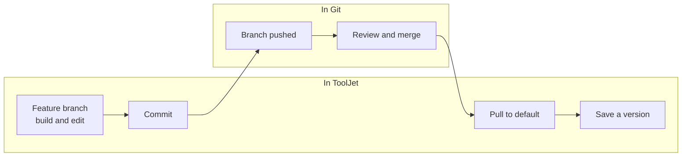

<PlanBadge type="enterprise" />

Branching lets several builders work on the same applications at the same time without overwriting each other. Each builder works on their own branch, where changes stay separate from what is live until they are reviewed and merged through a pull request in your Git provider. This protects production quality through mandatory review, and gives you a complete, traceable change history in Git.

Branching is useful when:

- Multiple builders work on the same applications at the same time.
- You need formal review and approval before changes reach production.
- Change tracking and auditability are organizational requirements.

## What a Branch Contains

A branch in ToolJet is not tied to a single application. Each branch holds its own copy of every application, module, datasource, and folder, so switching branches changes what you see across all of them at once.

All branches live inside the same workspace. You do not need a separate workspace for each branch, for each builder, or for each feature. Everyone works in one workspace and switches between branches in it.

There are two kinds of branches:

- **Default branch**: The branch configured in your Git Sync connection, typically `main` or `master`. It holds the live version of your applications. When branching is enabled, this branch is read-only and changes can only enter it through a merged pull request.
- **Feature branches**: Independent copies created from the default branch, where you make changes freely. Each feature branch is isolated until its changes are merged back.

## Single-Branch and Multi-Branch Mode

Git Sync starts in single-branch mode, which is included with Git Sync on the **Team** plan. Multiple branches require an **Enterprise** plan and are opted into per workspace. See [Enable Branching](/docs/beta/branching/multi-branch/enable-and-manage-branches) for how to turn them on.

| Behavior | Single-branch mode | Multi-branch mode |
|:---------|:-------------------|:------------------|
| Feature branches | Not available | Created from the default branch |
| Default branch | Editable | Read-only |
| Changes reach the default branch by | Committing directly | Merging a pull request |

When branching is enabled and you are on the default branch, ToolJet blocks these actions:

- Creating or editing applications and modules
- Creating or deleting datasources
- Creating applications from templates
- Using any AI features

## How Changes Reach the Default Branch

Branching splits the work between two systems. You build and commit in ToolJet, and the review and merge happen entirely in your Git provider. ToolJet cannot merge branches.

Refer to [Pull Requests](/docs/beta/branching/multi-branch/pull-requests) for the full flow, including how to open and track pull requests from ToolJet.

## Resources Covered by a Branch

Applications, modules, datasources and their folder assignments are branch-scoped. On a feature branch, changes to a module or datasource stay on that branch and reach the rest of the workspace only once they are committed and merged. In single-branch mode there is nothing to isolate them from, so those changes apply across the workspace immediately.

Workflows and ToolJet Database tables are not branch-scoped yet. They behave the same on every branch.

### Folders

Your folder structure in ToolJet is written to Git as the directory structure of the repository, so an application inside a **Billing** folder is committed to a `Billing/` directory.

Folders are also workspace-level rather than branch-scoped, so a folder created on one branch exists on all of them. Between those two constraints, multi-branch mode restricts folders everywhere, not just on the default branch:

| Action | Single-branch mode | Multi-branch mode |
|:-------|:-------------------|:------------------|
| Rename a folder | Allowed | Blocked |
| Delete an empty folder | Allowed | Allowed |
| Delete a folder containing resources | Blocked | Blocked, and the error names the branches still using it |

## Where Branch Controls Appear

The branch dropdown and the **Pull** button appear in the header on the **Applications**, **Data sources**, and **Modules** pages. The header **Commit** button appears only on the **Data sources** page. Applications and modules are committed from inside their builder, see [Push and Pull Commit](/docs/beta/branching/multi-branch/push-and-pull).

## Using Git Sync Across Multiple Instances

If you run separate ToolJet instances for different environments, you can connect them to the same Git repository. Git acts as the bridge between instances.

- **Development instance**: Builders create branches, make changes, commit, and merge pull requests. Saved versions are tagged in Git.
- **Staging or production instance**: Pull saved versions from Git to deploy and release them. No manual export or import is needed.

This enforces environment separation at the infrastructure level while keeping all instances in sync through a single repository.

:::info
To decide whether a single or multi-instance setup suits your organization, see [Choosing Your Instance Setup](/docs/tj-setup/instances#choosing-your-instance-setup).
:::

## Limitations

- Branching works with GitHub and GitLab.
- Branches can only be created from the default branch, not from another feature branch.
- Pull requests must be created and merged in your Git provider. ToolJet cannot merge branches.
- Branches cannot be renamed once created.
- Merge conflicts must be resolved in Git before merging.
- Workflows are not branch-scoped.
- Only one draft version is allowed per application per branch.

 
---

## Need Help?

- Reach out via our [Slack Community](https://join.slack.com/t/tooljet/shared_invite/zt-2rk4w42t0-ZV_KJcWU9VL1BBEjnSHLCA)
- Or email us at [support@tooljet.com](mailto:support@tooljet.com)
- Found a bug? Please report it via [GitHub Issues](https://github.com/ToolJet/ToolJet/issues)
