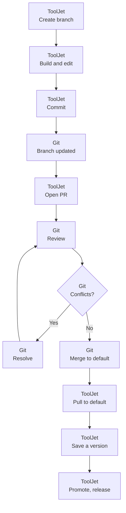

<PlanBadge type="enterprise" />

Pull requests are how changes move from a feature branch to the default branch. They are created, reviewed, and merged in your Git provider. ToolJet does not merge branches.

## How the Flow Splits Between ToolJet and Git

Every step below happens in one system or the other, never both. ToolJet takes you as far as opening the pull request, and everything from review to merge belongs to your Git provider.

## Create a Pull Request

1. **Commit your changes** on the feature branch so the branch in Git matches your workspace. See [Push and Pull Commit](/docs/beta/branching/multi-branch/push-and-pull).
2. Open the branch dropdown and click **Create pull request**. ToolJet opens your Git provider in a new tab with the source and target branches pre-filled.
3. **Add reviewers and a description**, then submit the pull request.
4. **Resolve any review feedback or merge conflicts** in Git.
5. **Merge the pull request** into the default branch.
6. **Pull the merged changes** into ToolJet: switch to the default branch and click **Pull**. If [auto-sync](/docs/beta/branching/auto-sync) is enabled with the pull request event, this happens automatically.

:::info
Merge conflicts must be resolved in your Git provider or your local Git client. ToolJet cannot resolve them.
:::

## Review Open Pull Requests

To see the pull requests for your repository:

1. Switch to the default branch.
2. Open the branch dropdown.
3. Click **Fetch PRs**.

ToolJet lists all open and closed pull requests in the repository, under the **Open PR** and **Closed PR** tabs. This list covers the whole repository and is not filtered to a single application.

On a feature branch, the dropdown instead offers **Fetch branch info**, which shows the latest commit on that branch.

## Example: Parallel Development

Two builders working on different features at the same time:

1. Builder A creates the branch `johnson/inventory` from the default branch.
2. Builder B creates the branch `taylor/search` from the default branch.
3. Both work independently and commit their changes.
4. In Git, both open pull requests against the default branch, resolve any merge conflicts, and the reviewer merges them.
5. In ToolJet, switch to the default branch and click **Pull** to bring in the merged changes.
6. Save the result as a version, then promote and release it.

 
---

## Need Help?

- Reach out via our [Slack Community](https://join.slack.com/t/tooljet/shared_invite/zt-2rk4w42t0-ZV_KJcWU9VL1BBEjnSHLCA)
- Or email us at [support@tooljet.com](mailto:support@tooljet.com)
- Found a bug? Please report it via [GitHub Issues](https://github.com/ToolJet/ToolJet/issues)
