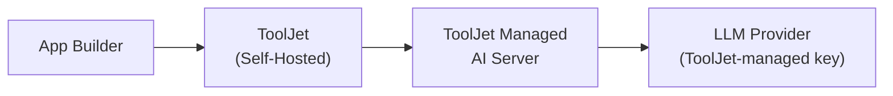

<PlanBadge type="self-hosted" />

Self-hosted ToolJet instances can use ToolJet-managed AI instead of deploying a separate AI server. AI requests from your instance are sent over the internet to ToolJet Managed AI Server, authenticated with ToolJet-managed LLM credentials, and billed against your instance's AI credits.

:::info
See [Setup ToolJet AI &rarr; Overview](/docs/setup/tooljet-ai/overview) for how this fits alongside the other AI setups and how the request is processed end-to-end.
:::

## Prerequisites

- A ToolJet license with the AI feature enabled.
- Outbound HTTPS (443) access from your ToolJet server to ToolJet Managed AI Server.

## Whitelisting Network Access

If your instance runs behind a firewall, proxy, or restricted egress policy, allow outbound HTTPS access to the following domains:

| Domain | Purpose |
|---|---|
| `https://api-gateway.tooljet.ai` | Routes AI requests to the configured LLM provider |
| `https://ai-server.tooljet.ai` | Backs the App Builder and other AI operations |

No inbound rules are required. All AI traffic is initiated by your ToolJet server.

If your instance uses an [HTTP proxy](/docs/setup/http-proxy), make sure these domains are reachable through it.

:::info
Instances running a version earlier than v3.20.220-lts use `https://python-server.tooljet.ai` in place of `https://ai-server.tooljet.ai`. Keep that rule in place until the instance is upgraded.
:::

:::tip
Using ToolJet [MCP](/docs/build-with-ai/mcp/overview) through a coding agent requires no additional network rules on self-hosted instances running v3.20.220-lts or later.
:::

## Setup

1. Confirm your license includes AI credits. If you need to purchase more, follow the **Self-Hosted Deployment** steps under [Buy Add-on Credits](/docs/build-with-ai/ai-credits#buy-add-on-credits).
2. Whitelist the domains listed above in your firewall, proxy, or network egress rules.
3. No further configuration is needed. AI features become available in your workspace automatically, billed against your instance's pooled AI credits.

## Billing

Credits are pooled at the **instance level** for self-hosted deployments. See [Understanding AI Credits](/docs/build-with-ai/ai-credits#credit-allocation) for details.

## Switching the AI Provider

With this setup, each user can pick which LLM provider powers their own AI chats. See [Selecting an AI Model](/docs/build-with-ai/model-selection) for details.

## Switching to a Different Setup

- On Self-hosted Enterprise, use your own LLM API key while continuing to route requests through ToolJet Managed AI Server with [Bring Your Own Key (BYOK)](/docs/setup/tooljet-ai/bring-your-own-key).
- To keep all AI traffic entirely within your own infrastructure with no data sent to ToolJet Managed AI Server, see [Setup ToolJet Enterprise AI](/docs/setup/tooljet-ai/tj-ai-enterprise).
