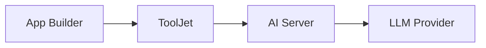
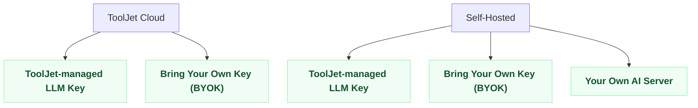

import Link from '@docusaurus/Link';

ToolJet AI can be powered in a few different ways depending on how ToolJet itself is deployed and how strict your data residency requirements are. This page explains how an AI request is processed, compares the available setups side by side, and helps you pick the right one for your organization.

## How an AI Request is Processed

export const SpecGrid = ({ items }) => (
    

        {items.map(([label, value], i) => (
            

                <strong>{label}</strong>: {value}
            

        ))}
    

);

export const GuideLink = ({ href, children }) => (
    

        <Link to={href} style={{ textDecoration: 'none' }}>
            
                {children} &rarr;
            
        </Link>
    

);

At a high level, every AI request follows the same path:

When you use an AI capability in the app builder, ToolJet sends the request to an AI Server, which talks to the LLM provider and returns the response. Your data source credentials and your underlying data never leave your deployment; only the prompt, app metadata, and schema needed for the AI to operate are sent to the AI Server.

ToolJet provides its own AI Server to handle these requests, and it can run in more than one place depending on your deployment.

## Where the AI Server Runs

### ToolJet Managed AI Server

This is the AI Server hosted and operated by ToolJet. It's used by default whether you're on ToolJet Cloud or self-hosting ToolJet, and requests reach it over the internet.

### Your Own AI Server

For organizations that need complete control over where AI workloads run, ToolJet also provides a server image that you deploy within your own infrastructure. When used, the AI Server itself runs on your network, and no request ever reaches ToolJet's infrastructure.

## Different Types of Setups

### ToolJet Cloud

#### ToolJet Managed AI Server with ToolJet Cloud

This is the default setup for any workspace on ToolJet Cloud. AI requests are routed to ToolJet Managed AI Server and authenticated using ToolJet-managed LLM credentials, no configuration is needed.

<SpecGrid items={[
    ['ToolJet deployment', 'ToolJet Cloud'],
    ['Requests routed via', 'ToolJet Managed AI Server'],
    ['LLM API key', 'ToolJet-managed'],
    ['Billing', 'ToolJet AI credits'],
    ['Data leaves your network', 'N/A, already on ToolJet Cloud'],
    ['Setup requirement', 'None'],
]} />

<GuideLink href="/docs/setup/tooljet-ai/managed-with-cloud">Read the full setup guide</GuideLink>

#### Use Your Own LLM API Key (BYOK)

Bring Your Own Key (BYOK) lets you configure your own LLM provider API key instead of using ToolJet-managed credentials. Requests still route through ToolJet Managed AI Server, only the credentials used to authenticate them change.

<SpecGrid items={[
    ['ToolJet deployment', 'Cloud or Self-hosted'],
    ['Requests routed via', 'ToolJet Managed AI Server'],
    ['LLM API key', 'Your own'],
    ['Billing', 'Direct from your LLM provider'],
    ['Data leaves your network', 'Yes, to ToolJet Managed AI Server'],
    ['Setup requirement', 'Configure your API key'],
]} />

<GuideLink href="/docs/setup/tooljet-ai/bring-your-own-key">Read the full setup guide</GuideLink>

### Self Hosted Deployments

#### ToolJet Managed AI Server

Self-hosted instances can use the same ToolJet Managed AI Server that powers ToolJet Cloud, instead of deploying a separate AI server. Your instance needs outbound network access to ToolJe Managed AI Server.

<SpecGrid items={[
    ['ToolJet deployment', 'Self-hosted'],
    ['Requests routed via', 'ToolJet Managed AI Server'],
    ['LLM API key', 'ToolJet-managed'],
    ['Billing', 'ToolJet AI credits'],
    ['Data leaves your network', 'Yes, to ToolJet Managed AI Server'],
    ['Setup requirement', 'Whitelisting of outbound domains'],
]} />

<GuideLink href="/docs/setup/tooljet-ai/managed-with-self-hosted">Read the full setup guide</GuideLink>

#### Use Your Own LLM API Key (BYOK)

Bring Your Own Key (BYOK) lets you configure your own LLM provider API key instead of using ToolJet-managed credentials. Requests still route through ToolJet Managed AI Server, only the credentials used to authenticate them change.

<SpecGrid items={[
    ['ToolJet deployment', 'Cloud or Self-hosted'],
    ['Requests routed via', 'ToolJet Managed AI Server'],
    ['LLM API key', 'Your own'],
    ['Billing', 'Direct from your LLM provider'],
    ['Data leaves your network', 'Yes, to ToolJet Managed AI Server'],
    ['Setup requirement', 'Configure your API key'],
]} />

<GuideLink href="/docs/setup/tooljet-ai/bring-your-own-key">Read the full setup guide</GuideLink>

#### ToolJet Enterprise AI

For organizations that cannot let any AI request leave their infrastructure, ToolJet provides a server image you deploy and operate yourself, using your own LLM API key. ToolJet Managed AI Server is not involved at all.

<SpecGrid items={[
    ['ToolJet deployment', 'Self-hosted only'],
    ['Requests routed via', 'Your own AI Server'],
    ['LLM API key', 'Your own'],
    ['Billing', 'Direct from your LLM provider'],
    ['Data leaves your network', 'No'],
    ['Setup requirement', 'Deploy a separate server image'],
]} />

<GuideLink href="/docs/setup/tooljet-ai/tj-ai-enterprise">Read the full setup guide</GuideLink>

## Which Setup Should I Use?

:::info
For a full breakdown of what data is shared with AI and how it's protected, see the [Privacy Policy](/docs/build-with-ai/privacy).
:::
