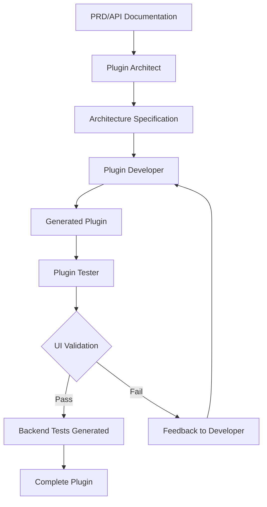

# CLAUDE.md - ToolJet Plugin Development Assistant

## Overview
This directory is for creating ToolJet plugins. Claude Code creates new plugins from scratch based on API documentation using validated schemas and templates.

## Important: CLI Usage
This guide uses the local ToolJet CLI from the repository instead of requiring npm package installation. All commands assume you're in the `marketplace` directory and use the relative path `../cli/bin/run` to execute CLI commands.

## MCP (Model Context Protocol) Configuration

The marketplace includes MCP server configuration for enhanced functionality. The configuration is stored in `.claude/.mcp.json`.

### Available MCP Servers

#### Postgres Database
- **Command**: `npx -y @modelcontextprotocol/server-postgres`
- **Connection**: PostgreSQL database for ToolJet development
- **Features**: Direct database access for testing and development

#### ClickUp Integration
The ClickUp MCP server is configured to provide access to ClickUp functionality:
- **Command**: `npx -y @taazkareem/clickup-mcp-server@latest`
- **Features**: 
  - Access to ClickUp tasks and projects
  - Document support enabled
  - Team-specific configuration
  - Fetch PRDs and API specifications from tasks

#### GitHub Integration
- **Command**: `npx -y @modelcontextprotocol/server-github`
- **Features**:
  - Access GitHub repositories, issues, and PRs
  - Fetch API documentation from GitHub
  - Manage plugin development workflow

#### Fetch Server
The fetch MCP server provides web fetching capabilities:
- **Command**: `npx -y @cloudmcp/mcp-server-fetch@latest`
- **Features**:
  - Fetch web pages and APIs
  - Handle HTTP requests
  - Parse and extract content from websites
  - Download OpenAPI specifications

#### Serena Integration
Serena MCP server provides advanced code analysis and editing capabilities:
- **Command**: `uvx --from git+https://github.com/oraios/serena serena-mcp-server --context ide-assistant --project $(pwd)`
- **Features**:
  - Symbol-level code analysis and editing
  - Language server integration for TypeScript/JavaScript
  - Advanced code search and refactoring
  - Project structure analysis and memory management
  - Intelligent code completion and validation

#### DeepWiki Integration
DeepWiki MCP server provides GitHub repository documentation analysis:
- **Command**: HTTP server at `https://mcp.deepwiki.com/mcp`
- **Features**:
  - Analyze GitHub repository documentation
  - Repository structure understanding
  - Documentation search and retrieval
  - API documentation parsing
  - Code pattern analysis from open source projects

### Using MCP Servers with Claude Code

To use the configured MCP servers:

1. Ensure you have the `.claude/.mcp.json` file in the marketplace directory
2. The MCP servers will be automatically loaded when using Claude Code
3. Available MCP tools will appear with the prefix `mcp__` in the tool list

### Manual MCP Server Setup

Alternatively, you can add servers directly using Claude Code MCP commands:

```bash
# Add DeepWiki for GitHub repository analysis
claude mcp add -s user -t http deepwiki https://mcp.deepwiki.com/mcp

# Add Serena for advanced code analysis (from ToolJet root directory)
claude mcp add serena -- uvx --from git+https://github.com/oraios/serena serena-mcp-server --context ide-assistant --project $(pwd)
```

### Configuration Structure

The MCP configuration follows this structure:

```json
{
  "servers": {
    "ServerName": {
      "command": "command to run",
      "args": ["arguments"],
      "env": {
        "ENV_VAR": "value"
      }
    }
  }
}
```

### Security Configuration

The `.claude/` directory includes a secure MCP configuration system:

#### Template-Based Configuration
- **`.mcp.json.template`**: Template with environment variable placeholders
- **`.env.template`**: Template for required environment variables
- **`setup.sh`**: Script to generate secure .mcp.json from template
- **`.mcp.json`**: Generated configuration (contains sensitive API keys)

#### Security Setup
```bash
# 1. Copy environment template and fill with your API keys
cp .claude/.env.template .claude/.env
# Edit .env with your actual API keys

# 2. Generate secure MCP configuration
cd .claude && ./setup.sh

# 3. Verify configuration
cat .claude/.mcp.json
```

#### Security Best Practices
- **Never commit** `.env` or `.mcp.json` files to git
- Use **environment variables** for all sensitive data
- Keep **file permissions** restricted (600 for .env)
- **Regenerate** .mcp.json when API keys change

## Claude Code Sub-Agents & Hooks

### Specialized Sub-Agents

The marketplace includes three specialized Claude Code sub-agents for comprehensive plugin development:

#### Plugin Architect (`plugin-architect`)
- **Purpose**: Analyze PRDs, design mockups, and API documentation
- **Input**: ClickUp tasks, GitHub issues, API specs, design files
- **Output**: Detailed architecture specification with UI requirements and SDK recommendations
- **Tools**: ClickUp MCP, GitHub MCP, Fetch MCP, DeepWiki MCP

**Usage**: `"Use the plugin-architect subagent to analyze this PRD and create architecture specification"`

#### Plugin Developer (`plugin-developer`) 
- **Purpose**: Generate complete plugin code based on architecture specifications
- **Input**: Architecture specs, SDK choices, UI requirements
- **Output**: Complete plugin with manifest.json, operations.json, index.ts, and types.ts
- **Tools**: CLI commands, schema validation, file editing, Serena MCP for advanced code analysis

**Usage**: `"Use the plugin-developer subagent to generate the plugin based on this architecture spec"`

#### Plugin Tester (`plugin-tester`)
- **Purpose**: Validate UI against design requirements and generate backend tests
- **Input**: Generated plugin, design mockups, UI requirements  
- **Output**: UI validation report, backend test suite, improvement feedback
- **Tools**: Playwright MCP, Jest, response stubbing

**Usage**: `"Use the plugin-tester subagent to validate the UI and generate backend tests"`

#### Plugin Reviewer (`plugin-reviewer`)
- **Purpose**: Perform final quality, security, and compliance review
- **Input**: Complete plugin, PRD requirements, security checklist
- **Output**: Review report, approval status, security recommendations
- **Tools**: Code analysis, security scanning, compliance validation

**Usage**: `"Have the plugin-reviewer subagent review the completed plugin"`

### Sub-Agent Workflow

The complete plugin development workflow follows this pattern:



### Simplified Hooks

The marketplace includes minimal Claude Code hooks for workflow coordination:

#### Subagent Completion Hook
- **Trigger**: When subagents complete their tasks  
- **Actions**: Log completion, provide workflow progress messages
- **Location**: `.claude/hooks/subagent-complete.sh`

### Agent Invocation Methods

You can invoke agents in multiple ways:

#### Natural Language (Recommended)
```bash
"Use the plugin-architect subagent to analyze https://api.stripe.com/docs"
"Have the plugin-developer subagent implement stripe-plugin"
"Use the plugin-tester subagent to validate stripe-plugin against Figma design"
"Have the plugin-reviewer subagent review stripe-plugin"
```

#### Complete Pipeline Command
```bash
/plugin-pipeline https://api.stripe.com/docs
/plugin-pipeline ClickUp task CU-12345
```

#### Auto-Delegation
Claude Code automatically selects appropriate subagents based on context and subagent descriptions.

### Development Logs

Simplified logging for tracking development activity:
- `.claude/logs/agent-activity.log` - Subagent completion tracking  
- `.claude/logs/plugin-issues.log` - Issue reporting and resolution

## .claude Directory Structure

The `.claude/` directory contains all Claude Code configurations:

```
.claude/
├── agents/                    # Subagent definitions
│   ├── plugin-architect.md   # API analysis & architecture
│   ├── plugin-developer.md   # Code generation & implementation
│   ├── plugin-tester.md      # UI validation & testing
│   └── plugin-reviewer.md    # Final quality review
├── commands/                  # Slash commands
│   └── plugin-pipeline.md    # Complete workflow automation
├── hooks/                     # Workflow automation scripts
│   └── subagent-complete.sh  # Simple completion logging
├── PLUGIN_SCHEMAS.md         # Complete schema reference
├── README.md                 # Directory overview and setup
├── WORKFLOW.md               # Workflow documentation with diagrams
├── .mcp.json.template        # MCP configuration template
├── .env.template             # Environment variables template
├── setup.sh                  # Configuration generator
└── settings.json             # Claude Code hook configuration
```

### Detailed Documentation Files

#### 📋 [`.claude/PLUGIN_SCHEMAS.md`](.claude/PLUGIN_SCHEMAS.md)
**Complete schema reference for plugin development**
- Manifest.json schema (connection configuration)  
- Operations.json schema (query operations)
- Widget types reference and properties
- Dynamic form rendering patterns
- Best practices and examples
- Legacy vs Modern schema formats

#### 🚀 [`.claude/QUICK-START.md`](.claude/QUICK-START.md)
**For new developers and quick reference**
- 5-minute plugin creation guide
- One-shot commands and examples
- Common use cases and patterns
- MCP configuration and troubleshooting
- Interactive examples and FAQ

#### 🛠️ [`.claude/DEVELOPER-GUIDE.md`](.claude/DEVELOPER-GUIDE.md)
**For comprehensive plugin development**
- Complete workflow from analysis to deployment
- Template system and schema development
- Advanced patterns and best practices
- TypeScript implementation guide
- Testing and validation procedures

#### 🔧 [`.claude/TECHNICAL-REFERENCE.md`](.claude/TECHNICAL-REFERENCE.md)
**For deep technical understanding**
- Schema architecture and integration points
- Component rendering and validation systems
- Advanced features and security considerations
- Migration guides and performance optimization
- Debugging and troubleshooting details

#### 📖 [`.claude/README.md`](.claude/README.md)
**Directory overview and setup instructions**
- File organization and purpose
- Quick setup checklist
- Tool integration overview
- Development environment configuration

#### 🤖 Sub-Agent Documentation
- **[`.claude/agents/plugin-architect.md`](.claude/agents/plugin-architect.md)**: PRD analysis and architecture specification
- **[`.claude/agents/plugin-developer.md`](.claude/agents/plugin-developer.md)**: Code generation and implementation
- **[`.claude/agents/plugin-tester.md`](.claude/agents/plugin-tester.md)**: UI validation and testing
- **[`.claude/agents/plugin-reviewer.md`](.claude/agents/plugin-reviewer.md)**: Final quality review and security audit

#### 🔄 Workflow Documentation
- **[`.claude/WORKFLOW.md`](.claude/WORKFLOW.md)**: Complete workflow with Mermaid diagrams

## Quick Start

### CLI Setup (First Time Only)
```bash
# From the marketplace directory, set up the CLI
cd ../cli
npm install
npm run build
cd ../marketplace

# Optional: Create an alias for convenience
alias tooljet="$(pwd)/../cli/bin/run"
```

### Creating Plugins
```bash
# Using relative path (recommended)
../cli/bin/run plugin create <plugin-name> --type=api --name="Plugin Name" --marketplace --non-interactive

# Or if you created an alias
tooljet plugin create <plugin-name> --type=api --name="Plugin Name" --marketplace --non-interactive

# Examples:
# "Create a Stripe plugin using https://stripe.com/docs/api"
# "Build a plugin for this OpenAPI spec: https://api.example.com/swagger.json"
# "Create a GitHub plugin with OAuth authentication"
```

## Schema System

### Schema Types and File Mapping
- **DynamicForm v1 Schema**: Validates `operations.json` files (used by DynamicForm component)
- **DynamicForm v2 Schema**: Validates `manifest.json` files (used by DynamicFormV2 component)

### Schema Files
- `schemas/dynamicform-v1-schema.json` - JSON Schema for operations.json validation
- `schemas/dynamicform-v2-schema.json` - JSON Schema for manifest.json validation

**Note**: These schemas achieve 100% validation accuracy across all ToolJet plugins. The validation script (`scripts/validate-schemas.js`) automatically detects schema versions and applies appropriate validation rules.

### Template System
**V1 Templates (Legacy Format):**
- `templates/v1/api-key-manifest.json` - Basic API key authentication
- `templates/v1/oauth-manifest.json` - OAuth authentication
- `templates/v1/openapi-manifest.json` - OpenAPI-based plugins
- `templates/v1/api-operations.json` - Standard CRUD operations
- `templates/v1/database-operations.json` - Database operations
- `templates/v1/openapi-operations.json` - OpenAPI operations

**V2 Templates (Modern Format with tj:version):**
- `templates/v2/api-key-manifest.json` - Enhanced API key authentication
- `templates/v2/oauth-manifest.json` - Modern OAuth configuration
- `templates/v2/database-manifest.json` - Database connections
- `templates/v2/multi-auth-manifest.json` - Multiple authentication methods

**Note**: Operations.json files always use DynamicForm v1 schema regardless of manifest version. V2 templates focus on enhanced manifest.json files with modern UI components and validation.

## Available Commands

### Create New Plugin
When asked to create a plugin, Claude Code will:
1. Run `../cli/bin/run plugin create <plugin-name> --type=<type> --name="<display-name>" --marketplace --non-interactive`
2. Navigate to the plugin directory
3. Analyze the provided API documentation 
4. **Select appropriate templates** based on authentication method
5. **Generate schema-compliant files**
6. **Validate against schemas using `npm run validate:plugin <plugin-name>`**
7. Install required dependencies
8. **Ensure 100% validation success before completing**

### Plugin Structure
```
marketplace/plugins/<plugin-name>/
├── package.json
├── lib/
│   ├── icon.svg
│   ├── index.ts
│   ├── manifest.json    # Uses DynamicForm v2 schema
│   ├── operations.json  # Uses DynamicForm v1 schema
│   └── types.ts
└── CLAUDE.md
```

## Step-by-Step Process

### 1. Plugin Creation
```bash
# Claude Code will run:
../cli/bin/run plugin create <plugin-name> --type=api --name="<display-name>" --marketplace --non-interactive

# Or for interactive mode (with prompts):
../cli/bin/run plugin create <plugin-name>
# - Plugin display name: <display-name>
# - Plugin type: api
```

### 2. API Analysis & Template Selection
Claude Code will analyze the provided documentation to determine:
- Authentication method (API key, OAuth, Bearer, Basic, etc.)
- Available endpoints and operations
- Required and optional parameters
- Response formats and error patterns
- Rate limiting considerations

**Template Selection Logic:**

For OpenAPI-based plugins (MUST use V1):
- **Manifest** → `templates/v1/openapi-manifest.json` or `templates/v1/api-key-manifest.json`
- **Operations** → `templates/v1/openapi-operations.json`
- **Implementation** → `templates/v1/openapi-index.ts`

For regular plugins (can use V1 or V2):
- **API Key Auth** → `templates/v2/api-key-manifest.json` (V2) or `templates/v1/api-key-manifest.json` (V1)
- **OAuth Auth** → `templates/v2/oauth-manifest.json` (V2) or `templates/v1/oauth-manifest.json` (V1)
- **Database** → `templates/v2/database-manifest.json`
- **Multi-Auth** → `templates/v2/multi-auth-manifest.json`
- **Operations** → `templates/v1/api-operations.json` or `templates/v1/database-operations.json`

### 3. Schema-Compliant File Generation

**IMPORTANT**: Claude Code MUST validate all generated files against the appropriate schema before finalizing the plugin. Use the schema files in `marketplace/schemas/` to ensure compliance.

#### manifest.json - Connection Configuration

**V1 Manifest (Legacy):**
- **Schema**: `plugins/schemas/manifest.schema.json`
- **Structure**: Traditional with `source.options` and `properties`
- **Use for**: OpenAPI-based plugins
- **UI Components**: Standard widgets (`text`, `password`, `dropdown`)

**V2 Manifest (Modern):**
- **Schema**: `marketplace/schemas/dynamicform-v2-schema.json`
- **Features**: 
  - Required `tj:version` field
  - `tj:ui:properties` for enhanced UI rendering
  - `tj:encrypted` for secure field handling
  - Conditional validation with `allOf`
- **UI Components**: 
  - `password-v3`: Enhanced password inputs
  - `text-v3`: Enhanced text inputs with validation
  - `dropdown-component-flip`: Dynamic form sections
  - `toggle`: Boolean switches

#### operations.json - Available Operations (Always V1)
- **Schema**: `marketplace/schemas/dynamicform-v1-schema.json`
- **All operations.json files use V1 schema regardless of manifest version**
- **Features**:
  - Traditional property structure
  - `dropdown-component-flip` for operation selection
  - `mandatory` field for required parameters
- **UI Components**:
  - `codehinter`: For dynamic values supporting `{{variables}}`
  - `text`: For static strings
  - `password`: For secrets
  - `dropdown`: For predefined choices
  - `toggle`: For boolean values
  - `textarea`: For multi-line text

#### index.ts - Core Logic
- API client initialization
- Operation implementations
- Error handling
- Connection testing
- Response transformation

#### types.ts - TypeScript Interfaces
- Source options interface
- Query options interface
- Custom types for the API

### 4. Schema Validation & Quality Assurance

Claude Code **MUST** validate all generated files:

```bash
# Pre-generation validation
- Validate template against schema before generation
- Check for required fields completeness
- Verify widget type compatibility

# Post-generation validation - RUN THESE COMMANDS:
cd marketplace
npm run validate:plugin <plugin-name>

# The validation will check:
- manifest.json against appropriate schema (V1: plugins/schemas OR V2: marketplace/schemas)
- operations.json against DynamicForm v1 schema (marketplace/schemas/dynamicform-v1-schema.json)
- All required fields are present
- Widget types are valid for respective schema versions
- No schema violations exist
```

**Quality Assurance Checklist:**
- [ ] Run `npm run validate:plugin <plugin-name>` - MUST PASS 100%
- [ ] `tj:version` present in V2 manifest.json
- [ ] Sensitive fields in `tj:encrypted` array (V2) or marked as encrypted (V1)
- [ ] Widget types match schema (v3 for V2 manifest, standard for V1)
- [ ] All required fields present
- [ ] Conditional validation properly structured
- [ ] No unreplaced template placeholders
- [ ] TypeScript compiles without errors

### 5. Dependency Installation
```bash
# Install required packages
npm i <package-name> --workspace=@tooljet-marketplace/<plugin-name>
```

## Schema Selection Guide

### **Schema and Template Selection Rules**

#### **Manifest.json Schema Selection:**

**V1 Manifest (Legacy):**
- Use for OpenAPI-based plugins with `react-component-api-endpoint`
- Traditional structure with `source.options` and `source.exposedVariables`
- Schema URL: `https://raw.githubusercontent.com/ToolJet/ToolJet/develop/plugins/schemas/manifest.schema.json`
- Examples: ClickUp, Google Calendar, EasyPost

**V2 Manifest (Modern):**
- Use for regular plugins wanting enhanced UI/validation
- Requires `tj:version` field and `tj:source` structure
- Schema URL: `https://raw.githubusercontent.com/ToolJet/ToolJet/develop/marketplace/schemas/dynamicform-v2-schema.json`
- Better widget types (`text-v3`, `password-v3`) and validation

#### **Operations.json (Always V1):**
- **ALL operations.json files use DynamicForm v1 schema**
- Schema URL: `https://raw.githubusercontent.com/ToolJet/ToolJet/develop/marketplace/schemas/dynamicform-v1-schema.json`
- Compatible with existing query manager
- Traditional widget types (`text`, `password`, `dropdown-component-flip`)

### **Template Selection Logic**

**For OpenAPI Plugins (MUST use V1):**
- **Manifest**: `templates/v1/openapi-manifest.json`
- **Operations**: `templates/v1/openapi-operations.json`

**For Regular API Plugins:**
- **V1 Manifest**: `templates/v1/api-key-manifest.json` or `oauth-manifest.json`
- **V2 Manifest**: `templates/v2/api-key-manifest.json` or `oauth-manifest.json`
- **Operations**: Always `templates/v1/api-operations.json`

**For Database Plugins:**
- **V1 Manifest**: Use V1 templates with legacy structure
- **V2 Manifest**: `templates/v2/database-manifest.json`
- **Operations**: `templates/v1/database-operations.json`

### **Property Naming Convention**
- **ALWAYS use camelCase** for property names (e.g., `apiKey`, `baseUrl`, `clientId`)
- Consistent across both V1 and V2 schemas
- Follows JavaScript/TypeScript conventions

## Interactive Questions

Claude Code will ask clarifying questions when needed:

1. **API Type Detection**
   - "Is this a REST, GraphQL, or SOAP API?"
   - "Does the API use standard REST conventions?"

2. **Authentication Details**
   - "I see multiple auth methods. Which should I implement?"
   - "Where should credentials be placed? (header/query/body)"
   - "What's the exact header name for authentication?"

3. **Operation Selection**
   - "Found 50+ endpoints. Should I include all or just common ones?"
   - "Which operations are most important for users?"

4. **Parameter Configuration**
   - "Should this parameter support dynamic values with {{}}?"
   - "Are there any enum values for this field?"
   - "Should this field be required or optional?"

## Intelligent Defaults

### Authentication Patterns
- `Authorization: Bearer <token>` → Bearer token auth
- `X-API-Key: <key>` → API key auth
- `Basic <credentials>` → Basic auth
- OAuth flows → OAuth configuration

### UI Component Selection
- email fields → text with email validation
- password/token/secret → password type
- boolean → toggle
- enum/choices → dropdown
- long text → textarea
- IDs/dynamic values → codehinter

### Common Operations
For well-known APIs, Claude Code knows common operations:
- **Stripe**: Customers, Payments, Charges, Subscriptions
- **GitHub**: Repos, Issues, PRs, Users
- **Slack**: Messages, Channels, Users
- **SendGrid**: Send Email, Templates, Contacts

## Validation & Testing Commands

### Schema Validation (Required)
```bash
# Validate all plugins
npm run validate

# Validate specific plugin
npm run validate:plugin <plugin-name>

# Validate specific files
node scripts/validate-schema.js <file-path> <v1|v2>

# Test connection with debug
tooljet plugin test <plugin-name> connection --debug
```

## 📚 Reference Documentation

### 🔍 When You Need More Details

**For Schema Questions:**
- **[PLUGIN_SCHEMAS.md](.claude/PLUGIN_SCHEMAS.md)** - Complete widget reference, field properties, dynamic form patterns
- **Use when:** Creating custom schemas, understanding widget types, troubleshooting form rendering

**For Technical Deep-Dive:**
- **[TECHNICAL-REFERENCE.md](.claude/TECHNICAL-REFERENCE.md)** - Schema architecture, component integration, validation systems  
- **Use when:** Understanding how schemas work under the hood, debugging integration issues, advanced customization

**For Quick Setup:**
- **[.claude/README.md](.claude/README.md)** - Configuration overview and directory structure
- **[.claude/settings.json](.claude/settings.json)** - Hook configuration and MCP setup

### 📋 Schema Quick Reference

| Need | Document | Section |
|------|----------|---------|
| Widget types (`text-v3`, `password-v3`, etc.) | PLUGIN_SCHEMAS.md | Widget Types Reference |
| Authentication patterns (API key, OAuth) | PLUGIN_SCHEMAS.md | Example Plugin Patterns |  
| V1 vs V2 schema differences | TECHNICAL-REFERENCE.md | Schema Architecture |
| Component rendering logic | TECHNICAL-REFERENCE.md | Schema Integration Points |
| Validation troubleshooting | TECHNICAL-REFERENCE.md | Validation Systems |
| Dynamic form cascading | PLUGIN_SCHEMAS.md | Dynamic Form Rendering |

## 💡 Pro Tips

### Optimization Tips
1. **Always provide full OpenAPI URL** - not just documentation page
2. **Have API credentials ready** - for immediate testing
3. **Check CORS policies** - some APIs block direct spec access
4. **Use specific endpoint lists** - for APIs with 100+ operations

### Finding API Information
- Look for "OpenAPI", "Swagger", or "API Reference"  
- Try adding `/openapi.json` or `/swagger.json` to base URLs
- Check developer portals for downloadable specs
- Use browser network tab to find spec URLs

### Best Practices
- Test connection immediately after creation
- Use `codehinter` for fields that might contain ToolJet variables
- Include helpful placeholders and descriptions
- Implement proper error handling for API failures

## 🎉 Examples

### Quick Stripe Plugin
```
You: Create a Stripe plugin using their API

Claude Code: Found OpenAPI spec at https://stripe.com/docs/api/openapi.json
✓ Plugin scaffolding created
✓ Detected API key authentication  
✓ Generated manifest.json with API key field
✓ Created operations.json with OpenAPI reference
✓ Implemented index.ts with standard handler

Test with: tooljet plugin test stripe connection
```

### Custom Weather Plugin  
```
You: Create a weather plugin for OpenWeatherMap

Claude Code: Which operations do you need?
- Current weather ✓
- 5-day forecast ✓  
- Weather alerts
- All of the above

You: Current weather and 5-day forecast

Claude Code: ✓ Added current weather operation
✓ Added 5-day forecast operation  
✓ API key authentication configured
✓ Error handling for invalid locations

Test with: tooljet plugin test weather connection
```

---

**Remember:** Claude Code is designed to do the heavy lifting. Just describe what you need, and it handles all technical boilerplate automatically!
